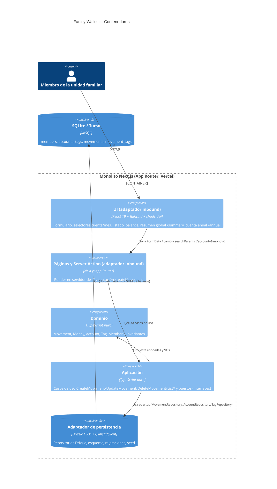
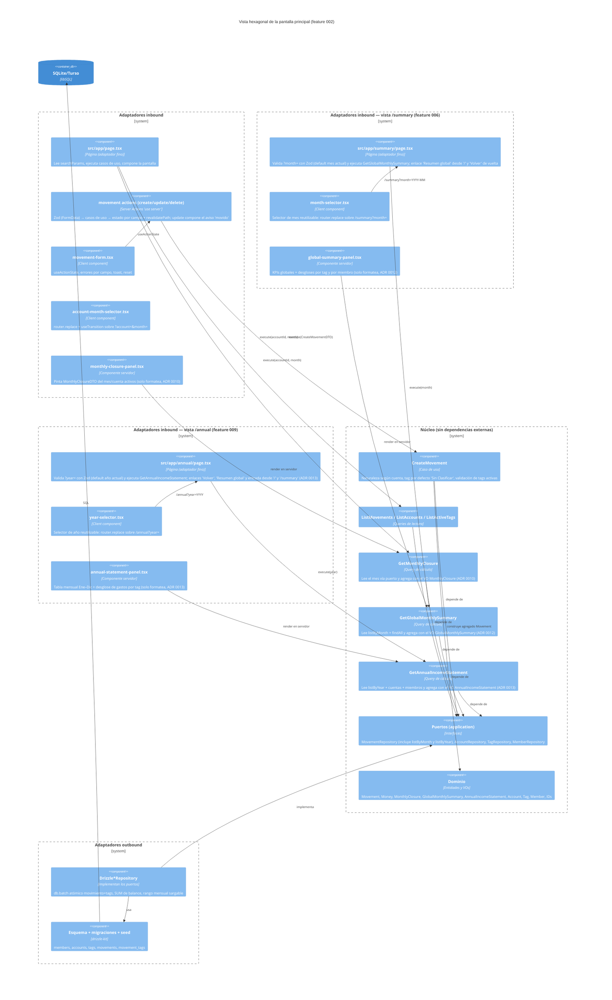

# Diagramas C4 — Family Wallet

Documento vivo de la evolución del diseño (feature 002 y siguientes). Los diagramas usan [mermaid](https://mermaid.js.org/); las features posteriores los extienden.

---

## Nivel 1: Contexto del sistema

```mermaid
C4Context
    title Family Wallet — Contexto del sistema
    Person(user, "Miembro de la unidad familiar", "Usuario único, sin login (modo PoC)")
    System(wallet, "Family Wallet", "Monolito Next.js: registro de gastos e ingresos con tags sobre 3 cuentas")
    System_Ext(turso, "Turso (libSQL)", "Base de datos SQLite administrada (producción)")
    System_Ext(vercel, "Vercel", "Plataforma serverless de despliegue")

    Rel(user, wallet, "Registra movimientos y consulta listado mensual/balance", "HTTPS")
    Rel(wallet, turso, "Lee/escribe movimientos, cuentas, tags", "libSQL/HTTPS")
    DeployRel(vercel, wallet, "Aloja el monolito")
```

En desarrollo local la persistencia es un fichero SQLite (`db.sqlite`) y el runtime es `npm run dev`.

## Nivel 2: Contenedores



## Nivel 3: Componentes — vista hexagonal construida por la feature 002



---

Véase también:

- [Diagrama de secuencia del flujo crítico "registrar movimiento"](./registro-movimiento-sequence.md) (ADR 0008).
- [Diagrama de secuencia del resumen global mensual](./resumen-global-sequence.md) (ADR 0012).
- [Diagrama de secuencia de la cuenta de resultados anual](./cuenta-anual-sequence.md) (ADR 0013).
- [Diagrama de clases del modelo de dominio](./domain-model.md).
