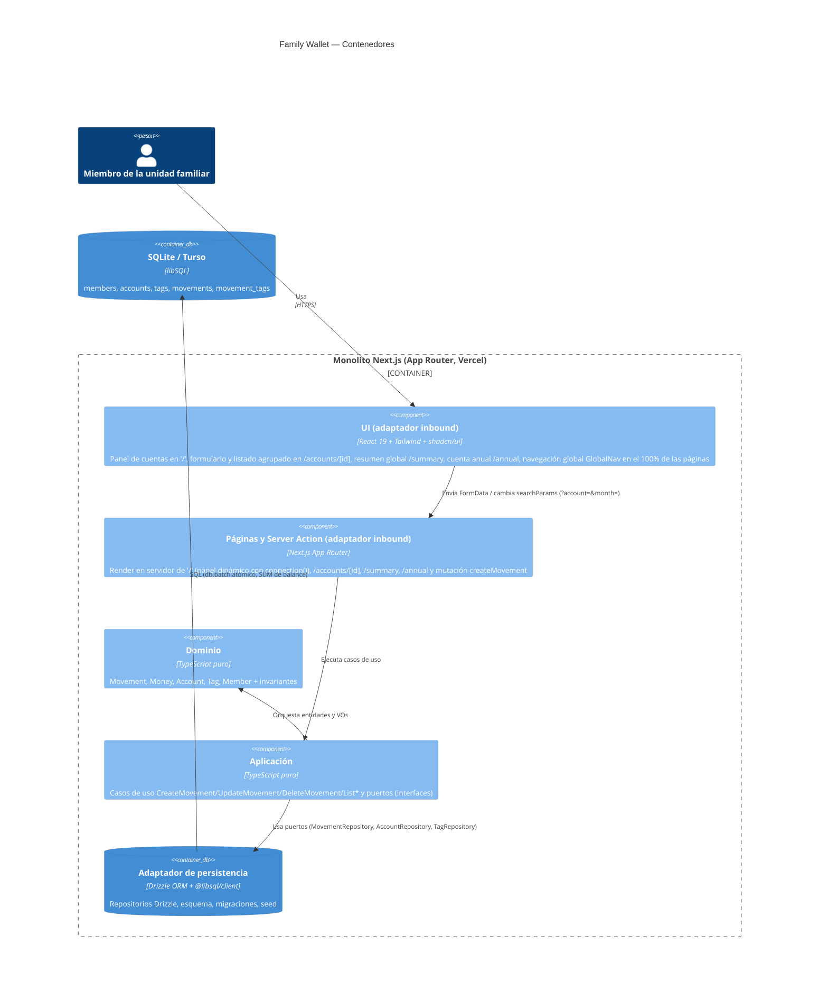

# Diagramas C4 — Family Wallet

Documento vivo de la evolución del diseño (feature 002 y siguientes). Los diagramas usan [mermaid](https://mermaid.js.org/); las features posteriores los extienden.

---

## Nivel 1: Contexto del sistema

```mermaid
C4Context
    title Family Wallet — Contexto del sistema
    Person(user, "Miembro de la unidad familiar", "Usuario único, sin login (modo PoC)")
    System(wallet, "Family Wallet", "Monolito Next.js: registro de gastos e ingresos con tags sobre 3 cuentas")
    System_Ext(turso, "Turso (libSQL)", "Base de datos SQLite administrada (producción)")
    System_Ext(vercel, "Vercel", "Plataforma serverless de despliegue")

    Rel(user, wallet, "Registra movimientos y consulta listado mensual/balance", "HTTPS")
    Rel(wallet, turso, "Lee/escribe movimientos, cuentas, tags", "libSQL/HTTPS")
    DeployRel(vercel, wallet, "Aloja el monolito")
```

En desarrollo local la persistencia es un fichero SQLite (`db.sqlite`) y el runtime es `npm run dev`.

## Nivel 2: Contenedores

```mermaid
C4Container
    title Family Wallet — Contenedores
    Person(user, "Miembro de la unidad familiar")
    Container_Boundary(web, "Monolito Next.js (App Router, Vercel)") {
        Component(browserUI, "UI (adaptador inbound)", "React 19 + Tailwind + shadcn/ui", "Panel de cuentas en '/', formulario y listado agrupado en /accounts/[id], resumen global /summary, cuenta anual /annual, navegación global GlobalNav en el 100% de las páginas")
        Component(server, "Páginas y Server Action (adaptador inbound)", "Next.js App Router", "Render en servidor de '/' (panel dinámico con connection()), /accounts/[id], /summary, /annual y mutación createMovement")
        Component(domain, "Dominio", "TypeScript puro", "Movement, Money, Account, Tag, Member + invariantes")
        Component(application, "Aplicación", "TypeScript puro", "Casos de uso CreateMovement/UpdateMovement/DeleteMovement/List* y puertos (interfaces)")
        ContainerDb(dbAdapter, "Adaptador de persistencia", "Drizzle ORM + @libsql/client", "Repositorios Drizzle, esquema, migraciones, seed")
    }
    ContainerDb(sqlite, "SQLite / Turso", "libSQL", "members, accounts, tags, movements, movement_tags")

    Rel(user, browserUI, "Usa", "HTTPS")
    Rel(browserUI, server, "Envía FormData / cambia searchParams (?account=&month=)")
    Rel(server, application, "Ejecuta casos de uso")
    Rel(application, domain, "Orquesta entidades y VOs")
    Rel(application, dbAdapter, "Usa puertos (MovementRepository, AccountRepository, TagRepository)")
    Rel(dbAdapter, sqlite, "SQL (db.batch atómico, SUM de balance)")
```

## Nivel 3: Componentes — vista hexagonal construida por la feature 002

```mermaid
C4Component
    title Vista hexagonal de la pantalla principal (feature 002)
    ContainerDb(db, "SQLite/Turso", "libSQL")

    Boundary(inbound, "Adaptadores inbound") {
        Component(page, "src/app/page.tsx", "Página (adaptador fino)", "Panel de cuentas (feature 012): await connection() + ListAccounts → GlobalNav + AccountCardGrid; sin searchParams")
        Component(action, "movement actions (create/update/delete)", "Server Actions 'use server'", "Zod (FormData) → casos de uso → estado por campo + revalidatePath; update compone el aviso 'movido'")
        Component(form, "movement-form.tsx", "Client component", "useActionState, errores por campo, toast, reset")
        Component(globalNav, "global-nav.tsx", "Componente servidor (feature 012)", "Navegación global Panel · Resumen global · Cuenta de resultados; aria-current y mes por prop (currentMonth() por defecto)")
        Component(cardGrid, "account-card-grid.tsx", "Componente servidor (feature 012)", "Rejilla responsiva de tarjetas-Link a /accounts/{id} (lanzador puro: nombre + tipo)")
        Component(panel, "monthly-closure-panel.tsx", "Componente servidor", "Pinta MonthlyClosureDTO del mes/cuenta activos (solo formatea, ADR 0010)")
    }

    Boundary(inboundSummary, "Adaptadores inbound — vista /summary (feature 006)") {
        Component(summaryPage, "src/app/summary/page.tsx", "Página (adaptador fino)", "Valida ?month= con Zod (default mes actual) y ejecuta GetGlobalMonthlySummary; GlobalNav active=\"summary\" (feature 012)")
        Component(monthSelector, "month-selector.tsx", "Client component", "Selector de mes reutilizable: router.replace sobre /summary?month=")
        Component(summaryPanel, "global-summary-panel.tsx", "Componente servidor", "KPIs globales + desgloses por tag y por miembro (solo formatea, ADR 0012)")
    }

    Boundary(inboundAnnual, "Adaptadores inbound — vista /annual (feature 009)") {
        Component(annualPage, "src/app/annual/page.tsx", "Página (adaptador fino)", "Valida ?year= con Zod (default año actual) y ejecuta GetAnnualIncomeStatement; GlobalNav active=\"annual\" con ${year}-01 (feature 012)")
        Component(yearSelector, "year-selector.tsx", "Client component", "Selector de año reutilizable: router.replace sobre /annual?year=")
        Component(annualPanel, "annual-statement-panel.tsx", "Componente servidor", "Tabla mensual Ene–Dic + desglose de gastos por tag (solo formatea, ADR 0013)")
    }

    Boundary(inboundAccount, "Adaptadores inbound — vista /accounts/[accountId] (feature 011)") {
        Component(accountPage, "src/app/accounts/[accountId]/page.tsx", "Página (adaptador fino)", "Valida accountId/month con Zod; cuenta inexistente → notFound() (404); balance acumulado con getBalance(id, asOf=fin de mes); GlobalNav active=\"panel\" (feature 012)")
        Component(stepper, "month-stepper.tsx", "Client component", "Selector ‹ › + picker acotado al mes actual real: router.replace preservando la cuenta en la URL")
        Component(groupedList, "grouped-movement-list.tsx", "Client component", "Agrupa por fecha el orden de ListMovements (reduce en presentación), fila rediseñada tags/nota/importe, diálogos de 003 al nivel del listado, vacío interno")
    }

    Boundary(core, "Núcleo (sin dependencias externas)") {
        Component(usecaseCreate, "CreateMovement", "Caso de uso", "Naturaleza según cuenta, tag por defecto 'Sin Clasificar', validación de tags activas")
        Component(usecaseList, "ListMovements / ListAccounts / ListActiveTags", "Queries de lectura")
        Component(usecaseClosure, "GetMonthlyClosure", "Query de cálculo", "Lee el mes vía puerto y agrega con el VO MonthlyClosure (ADR 0010)")
        Component(usecaseGlobalSummary, "GetGlobalMonthlySummary", "Query de cálculo", "Lee listByMonth + findAll y agrega con el VO GlobalMonthlySummary (ADR 0012)")
        Component(usecaseAnnualStatement, "GetAnnualIncomeStatement", "Query de cálculo", "Lee listByYear + cuentas + miembros y agrega con el VO AnnualIncomeStatement (ADR 0013)")
        Component(ports, "Puertos (application)", "Interfaces", "MovementRepository (incluye listByMonth y listByYear), AccountRepository, TagRepository, MemberRepository")
        Component(entities, "Dominio", "Entidades y VOs", "Movement, Money, MonthlyClosure, GlobalMonthlySummary, AnnualIncomeStatement, Account, Tag, Member, IDs")
    }

    Boundary(outbound, "Adaptadores outbound") {
        Component(repos, "Drizzle*Repository", "Implementan los puertos", "db.batch atómico movimiento+tags, SUM de balance, rango mensual sargable")
        Component(drizzle, "Esquema + migraciones + seed", "drizzle-kit", "members, accounts, tags, movements, movement_tags")
    }

    Rel(form, action, "useActionState")
    Rel(action, usecaseCreate, "execute(CreateMovementDTO)")
    Rel(page, usecaseList, "execute() (ListAccounts)")
    Rel(page, globalNav, "active=\"panel\"")
    Rel(page, cardGrid, "accounts")
    Rel(cardGrid, accountPage, "Link /accounts/{id}")
    Rel(accountPage, globalNav, "active=\"panel\", month")
    Rel(summaryPage, globalNav, "active=\"summary\", month")
    Rel(annualPage, globalNav, "active=\"annual\", ${year}-01")
    Rel(page, usecaseClosure, "execute(accountId, month)")
    Rel(panel, usecaseClosure, "render en servidor")
    Rel(summaryPage, usecaseGlobalSummary, "execute(month)")
    Rel(monthSelector, summaryPage, "/summary?month=YYYY-MM")
    Rel(summaryPanel, usecaseGlobalSummary, "render en servidor")
    Rel(annualPage, usecaseAnnualStatement, "execute(year)")
    Rel(yearSelector, annualPage, "/annual?year=YYYY")
    Rel(annualPanel, usecaseAnnualStatement, "render en servidor")
    Rel(accountPage, usecaseList, "execute(accountId, month)")
    Rel(accountPage, ports, "getBalance(id, asOf=monthEndIsoDate(month))")
    Rel(accountPage, usecaseClosure, "execute(accountId, month)")
    Rel(stepper, accountPage, "/accounts/{id}?month=YYYY-MM")
    Rel(groupedList, action, "editar / eliminar (diálogos de 003)")
    Rel(groupedList, usecaseList, "consume MovementDTO[] ya ordenado (agrupa en presentación)")
    Rel(usecaseCreate, ports, "depende de")
    Rel(usecaseList, ports, "depende de")
    Rel(usecaseClosure, ports, "depende de")
    Rel(usecaseGlobalSummary, ports, "depende de")
    Rel(usecaseAnnualStatement, ports, "depende de")
    Rel(usecaseCreate, entities, "construye agregado Movement")
    Rel(repos, ports, "implementa")
    Rel(repos, drizzle, "usa")
    Rel(drizzle, db, "SQL")
```

---

Véase también:

- [Diagrama de secuencia del flujo crítico "registrar movimiento"](./registro-movimiento-sequence.md) (ADR 0008).
- [Diagrama de secuencia del panel de cuentas](./panel-cuentas-sequence.md) (feature 012).
- [Diagrama de secuencia del resumen global mensual](./resumen-global-sequence.md) (ADR 0012).
- [Diagrama de secuencia de la cuenta de resultados anual](./cuenta-anual-sequence.md) (ADR 0013).
- [Diagrama de secuencia de la página de cuenta](./pagina-cuenta-sequence.md) (feature 011).
- [Diagrama de clases del modelo de dominio](./domain-model.md).
