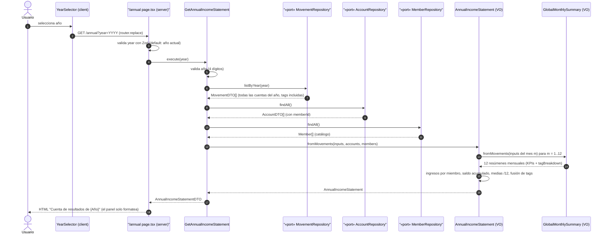

# Secuencia: cuenta de resultados anual (feature 009)

Diagrama de secuencia del happy path de `GetAnnualIncomeStatement` sobre la vista `/annual` (ADR 0013). Base: diagrama de diseño de [plan.md](../../../specs/009-cuenta-resultados-anual/plan.md) de la feature.

Notas:

- La entrada también puede llegar desde el enlace "Cuenta de resultados" de la pantalla principal (`/annual?year={año del mes activo}`) o de `/summary` (`/annual?year={año del mes visible}`); `/annual` enlaza de cruce a "Resumen global" (`/summary?month={año}-01`).
- `AnnualIncomeStatement` **compone** 12 `GlobalMonthlySummary` (uno por mes, los vacíos incluidos): FR-006 (coherencia al céntimo con `/summary`) es una garantía estructural clavada con test de invariante. En pasadas propias añade la atribución de ingresos por miembro (dueño de la cuenta de registro; `null` = cuenta común), el saldo acumulado desde enero (FR-012, sin media) y las medias mensuales `total/12` con redondeo al céntimo (único punto de redondeo, ADR 0007).
- Nada se persiste: la cuenta anual es una vista derivada recalculada en cada consulta (extensión del ADR 0009).
