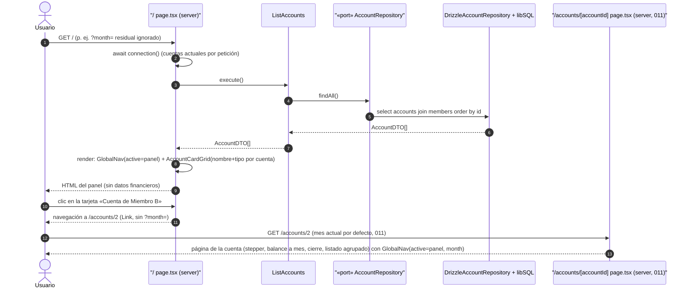

# Secuencia — Panel de cuentas (feature 012)

Happy path: abrir `/` y entrar a una cuenta desde el panel de tarjetas. `/` es un lanzador puro (nombre + tipo, sin datos financieros) renderizado dinámicamente por petición (`await connection()`), única lectura `ListAccounts`.

Notas (decisiones de 012, `specs/012-panel-cuentas/research.md`):

- **`await connection()`**: sin ella, Next 16 prerenderizaría el panel en build y congelaría las cuentas (research §3). La página no lee `searchParams`: `/?month=` residual se ignora por diseño.
- **`GlobalNav({ active, month? })` de servidor renderizada por cada página** (no en `layout.tsx`): los layouts no reciben `searchParams` y la variante cliente exigiría `<Suspense>` (research §1). Propaga el mes visible; `/annual` pasa `${year}-01` (paridad con su antiguo nav local).
- **`AccountCardGrid`**: proyección pura de `AccountDTO` sin cálculo (FR-002); el destino `/accounts/{id}` va sin `?month=` porque la página de cuenta aplica su mes actual por defecto.
