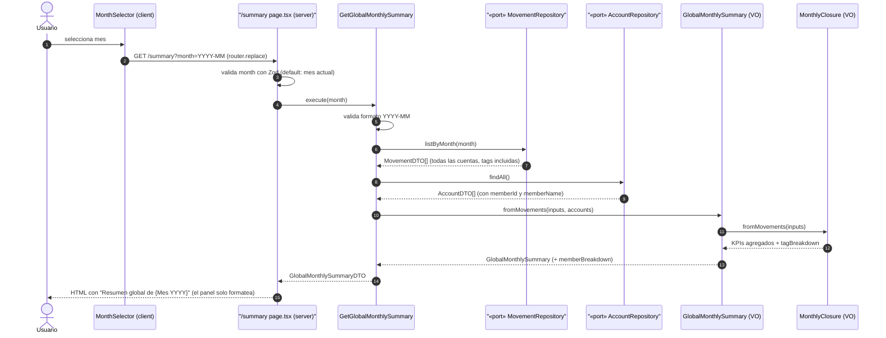

# Secuencia: resumen global mensual (feature 006)

Diagrama de secuencia del happy path de `GetGlobalMonthlySummary` sobre la vista `/summary` (ADR 0012). Base: diagrama de diseño de [plan.md](../../../specs/006-resumen-global-mensual/plan.md) de la feature.

Notas:

- La entrada también puede llegar desde el enlace "Resumen global" de la pantalla principal (`/summary?month={mes activo}`).
- `GlobalMonthlySummary` **compone** `MonthlyClosure` para los KPIs agregados y el desglose por tag (única fuente de reglas, FR-002 estructural); el desglose por miembro se calcula en pasada propia agrupando por `memberId` (`null` = cuenta común).
- Nada se persiste: el resumen es una vista derivada recalculada en cada consulta (extensión del ADR 0009).
