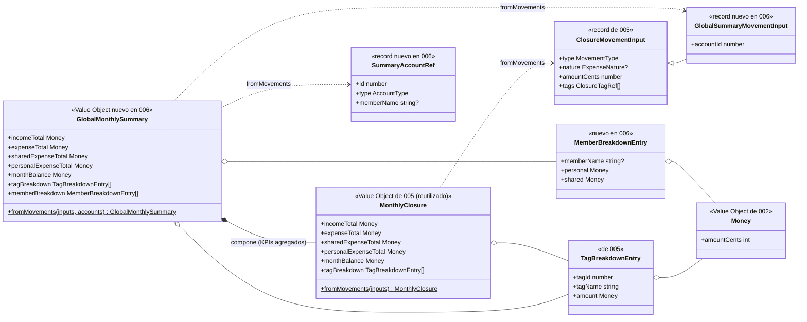

# Data Model: Resumen Mensual Global

**Feature**: `006-resumen-global-mensual` | **Fecha**: 2026-09-15

Feature de solo lectura: **no hay cambios** en entidades, tablas, índices ni migraciones (FR-005). Se añade un VO de dominio calculado (`GlobalMonthlySummary`, que compone `MonthlyClosure`), un método de lectura al puerto `MovementRepository`, DTOs de aplicación y el mapeo entre capas. Las entidades de 002 (Miembro, Cuenta, Movimiento, Tag) siguen siendo la única fuente de verdad ([data-model de 002](../002-registro-movimientos/data-model.md)).

---

## 1. Vista de Dominio

### 1.1 Value Object `GlobalMonthlySummary` (src/domain/movement/GlobalMonthlySummary.ts)

Resumen mensual global: agregación inmutable calculada sobre los movimientos de UN mes de TODAS las cuentas (precondición: el llamador garantiza el ámbito; el VO no re-valida el mes). **Compone** `MonthlyClosure` para los KPIs agregados y añade el desglose por miembro en pasada propia.

**Factory**:

```text
GlobalMonthlySummary.fromMovements(
  inputs: GlobalSummaryMovementInput[],
  accounts: SummaryAccountRef[],
): GlobalMonthlySummary
```

**Inputs** (registros puros de dominio, definidos junto al VO; la aplicación los construye desde DTOs):

| Registro | Campo | Tipo | Regla |
|---|---|---|---|
| `GlobalSummaryMovementInput` | (hereda `ClosureMovementInput` de 005) | `type`, `nature`, `amountCents`, `tags` | Mismas reglas que el cierre (005 §1.1); `nature` se ignora si `type = 'income'` (defensivo). |
| | `accountId` | `number` | Cuenta desde la que se pagó; se usa SOLO para la atribución por miembro. |
| `SummaryAccountRef` | `id` | `number` | Identifica la cuenta de pago. |
| | `type` | `'personal' \| 'shared'` | Solo las cuentas personales atribuyen gastos a un miembro. |
| | `memberName` | `string \| null` | Dueño de la cuenta personal; `null` en la cuenta común (sin atribución). |

**Campos del VO** (inmutables; los cinco primeros delegan en el `MonthlyClosure` interno):

| Campo | Tipo | Cálculo |
|---|---|---|
| incomeTotal | `Money` | Σ `amountCents` de type = `'income'` (todas las cuentas). |
| expenseTotal | `Money` | Σ de type = `'expense'`. |
| sharedExpenseTotal | `Money` | Σ de gastos con nature = `'shared'`, con independencia de la cuenta de pago (FR-002). |
| personalExpenseTotal | `Money` | Σ de gastos con nature = `'personal'`. |
| monthBalance | `Money` | `incomeTotal − expenseTotal`; admite negativo. |
| tagBreakdown | `ReadonlyArray<TagBreakdownEntry>` | Misma regla que el cierre: un gasto suma una vez por cada tag que lleva; orden importe desc, desempate nombre asc (`localeCompare es`). |
| memberBreakdown | `ReadonlyArray<MemberBreakdownEntry>` | Solo gastos. Por cada gasto: cuenta de pago → si es personal, al `memberName` de su dueño; si es común, al bucket sin atribución. Acumula `personal`/`shared` según la naturaleza del gasto. Solo filas con algún gasto; orden total (personal+shared) desc, desempate nombre asc, fila sin atribución al final. |

`MemberBreakdownEntry` (dominio): `{ memberName: string | null; personal: Money; shared: Money }` — `memberName = null` significa "pagado desde la cuenta común" (la UI lo etiqueta "Cuenta común", contracts §3).

**Invariantes** (verificados en tests del VO):

1. Todo lo heredado del cierre: `shared + personal = expenseTotal`; multi-tag computa en cada tag sin duplicar `expenseTotal`; mes vacío → ceros y desgloses vacíos; sin floats (`Money`, ADR 0007).
2. **Coherencia (FR-002/SC-003)**: `GlobalMonthlySummary.fromMovements(unión del mes)` = Σ de los `MonthlyClosure` de cada cuenta, KPI a KPI; y `tagBreakdown` global = fusión de los desgloses por cuenta. Garantía estructural de la composición + test explícito de invariante.
3. La Σ de `memberBreakdown` (personal+shared de todas las filas) = `expenseTotal` (cada gasto computa exactamente en una fila, la de su cuenta de pago).
4. Los ingresos no aparecen en ningún desglose (FR-004; regla de 005 para tags).

### 1.2 Entidades y VOs reutilizados (sin cambios)

`Money`, `MovementType`, `ExpenseNature`, `MonthlyClosure` (005), `Movement`, `Account`, `Tag`, `Member` e IDs: ver [data-model de 002 §1](../002-registro-movimientos/data-model.md) y [005 §1.1](../005-cierre-mensual/data-model.md).

### 1.3 Relaciones (dominio)

```text
Movement (del mes, todas las cuentas) ──agrega──▶ GlobalMonthlySummary   (n──1, cálculo unidireccional puro)
GlobalMonthlySummary ──compone──▶ MonthlyClosure                         (1──1, KPIs agregados)
Account ──se proyecta en──▶ GlobalMonthlySummary.memberBreakdown          (por nombre de miembro, no por referencia)
```

`GlobalMonthlySummary` no referencia entidades: solo datos calculados (VO de salida).

### 1.4 Errores de dominio

Ninguno nuevo: la factory es total sobre inputs bien formados (los movimientos ya validaron al crearse). El caso de uso `GetGlobalMonthlySummary` valida el formato del mes (`YYYY-MM`) antes de consultar el puerto —misma regla que `ListMovements`/`GetMonthlyClosure`— y no introduce excepciones propias.

### 1.5 Transiciones de estado

Ninguna: VO inmutable recalculado en cada consulta (FR-005, ADR 0009/0012).

### 1.6 Diagrama de clases (diseño)

Foto del diseño de esta feature; la documentación viva del modelo de dominio (`docs/architecture/diagrams/domain-model.md`) se extiende en la fase de implementación reutilizándolo como base.



---

## 2. Vista de Persistencia (Drizzle, SQLite/Turso)

**Sin cambios de esquema ni migraciones** ([data-model de 002 §2](../002-registro-movimientos/data-model.md)). Único cambio en el adaptador:

### 2.1 Puerto `MovementRepository` (ampliación, src/application/movement/MovementRepository.ts)

```text
+ listByMonth(month: string): Promise<MovementDTO[]>   // movimientos de TODAS las cuentas del mes, tags incluidas
```

> **Formato de `month`**: `YYYY-MM` (año y mes, p. ej. `2026-09`) — el año va incluido en el parámetro, convención de 002/005 (searchParams, selector y cierres). El rango de la query cruza correctamente el cambio de año (diciembre → enero del año siguiente).

Implementación `DrizzleMovementRepository.listByMonth`: la query de `listByMonthAndAccount` sin filtro de cuenta — rango semicerrado sargable `[month-01, primer día del mes siguiente)`, `LEFT JOIN` de tags, `ORDER BY date DESC, id DESC`. La lectura de cuentas usa el puerto existente `AccountRepository.findAll()` (devuelve `memberName`).

**Nota de rendimiento (FR-008)**: el índice existente `(account_id, date)` no indexa rangos solo por `date`; la query escanea la tabla — sub-milisegundo a escala familiar (miles de filas), sin índice nuevo (FR-005 prohíbe migraciones en esta feature; YAGNI, research §2).

---

## 3. Validación por capa (dónde vive cada regla)

| Regla | Frontera (Zod) | Aplicación | Dominio (VO `GlobalMonthlySummary`) | DB |
|---|---|---|---|---|
| searchParams month (ruta `/summary`) | ✅ `src/app/summary/page.tsx` (mismo patrón que `/`, ADR 0008) | — | — | — |
| Formato de mes `YYYY-MM` del caso de uso | — | ✅ `GetGlobalMonthlySummary` (misma regla que `ListMovements`) | — | — |
| Σ ingresos/gastos/naturaleza global | — | — | ✅ por composición (`MonthlyClosure`) | — |
| Saldo del mes global (admite negativo) | — | — | ✅ `Money.fromCentsOrZero` | — |
| Multi-etiquetado: una vez por tag, sin duplicar total | — | — | ✅ (regla heredada del cierre) | — |
| Atribución por miembro (cuenta de pago → dueño; común → sin atribución) | — | — | ✅ pasada propia del VO | — |
| Orden de ambos desgloses (importe/total desc, nombre asc, null al final) | — | — | ✅ | — |
| Solo gastos en los desgloses | — | — | ✅ | — |
| Mapeo `MovementDTO[]`+`AccountDTO[]` → inputs de dominio → `GlobalMonthlySummaryDTO` | — | ✅ `GetGlobalMonthlySummary` | — | — |
| Rango exacto del mes, todas las cuentas | — | — | — | ✅ `listByMonth` (test contra libsql `:memory:`) |
| Formato es-ES y signo del saldo | — | — | — | — (adaptador UI `format.ts`) |

La UI **nunca** calcula: recibe `GlobalMonthlySummaryDTO` y formatea (constitución VII).

---

## 4. DTOs de aplicación (src/application/movement/dto.ts — ampliación)

```text
GlobalMonthlySummaryDTO
├── incomeTotalCents: number
├── expenseTotalCents: number
├── sharedExpenseCents: number
├── personalExpenseCents: number
├── monthBalanceCents: number          // puede ser negativo
├── tagBreakdown: TagBreakdownEntryDTO[]          (reutilizado de 005)
└── memberBreakdown: MemberBreakdownEntryDTO[]

MemberBreakdownEntryDTO
├── memberName: string | null          // null = pagado desde la cuenta común ("Cuenta común" en UI)
├── personalCents: number              // gastos personales atribuidos a ese ámbito
└── sharedCents: number                // gastos compartidos atribuidos a ese ámbito
```

Céntimos enteros en DTO (mismo criterio que `MovementDTO`/`MonthlyClosureDTO`); el formateo a EUR es exclusivo del adaptador UI.

---

## 5. Glosario ES ↔ EN (ampliación del glosario de 002/005)

| Español (UI/spec) | English (código) | Notas |
|---|---|---|
| Resumen global (mensual) | `GlobalMonthlySummary` | VO de dominio calculado (no persistido); compone `MonthlyClosure` |
| Desglose por miembro | `memberBreakdown` / `MemberBreakdownEntry` | Atribución por dueño de la cuenta de pago |
| Cuenta común (fila del desglose) | `memberName: null` | La etiqueta vive solo en la UI |
| Gastos personales/compartidos de un ámbito | `personal` / `shared` (`Money`) | Dentro de `MemberBreakdownEntry` |
| Resumen global (ruta) | `/summary` | `src/app/summary/page.tsx`, searchParam `month` |
| Panel del resumen | `GlobalSummaryPanel` | Componente servidor de UI |
| Selector de mes | `MonthSelector` | Componente cliente reutilizable (sin cuenta) |
| Movimientos del mes (todas las cuentas) | `listByMonth` | Método del puerto `MovementRepository` |
