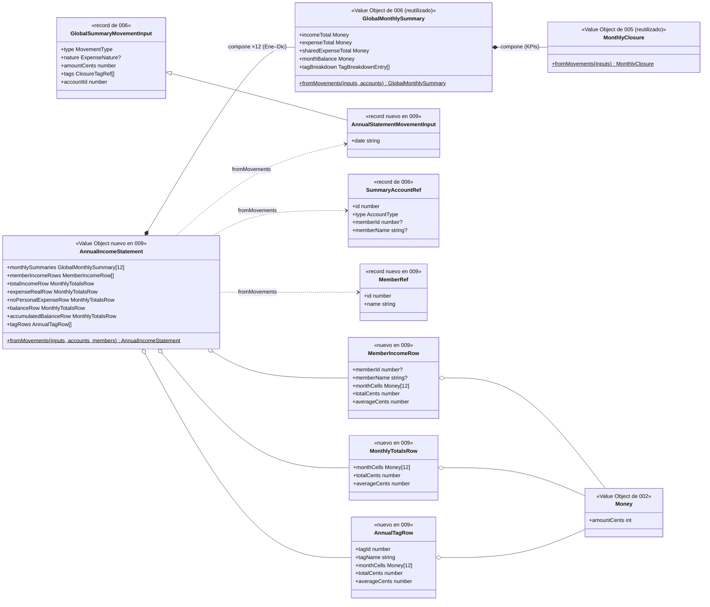

# Data Model: Cuenta de Resultados Anual

**Feature**: `009-cuenta-resultados-anual` | **Fecha**: 2026-09-23

Feature de solo lectura: **no hay cambios** en entidades, tablas, índices ni migraciones (FR-008). Se añade un VO de dominio calculado (`AnnualIncomeStatement`, que compone 12 `GlobalMonthlySummary`), un método de lectura al puerto `MovementRepository`, DTOs de aplicación y el mapeo entre capas. Las entidades de 002 (Miembro, Cuenta, Movimiento, Tag) siguen siendo la única fuente de verdad ([data-model de 002](../002-registro-movimientos/data-model.md)).

---

## 1. Vista de Dominio

### 1.1 Value Object `AnnualIncomeStatement` (src/domain/movement/AnnualIncomeStatement.ts)

Cuenta de resultados anual: agregación inmutable calculada sobre los movimientos de UN año de TODAS las cuentas (precondición: el llamador garantiza el ámbito; el VO no re-valida el año). **Compone** 12 `GlobalMonthlySummary` (uno por mes Ene–Dic; los meses sin movimientos producen un resumen a ceros) y añade en pasadas propias la atribución de ingresos por miembro, el saldo acumulado, las medias mensuales y la fusión anual de tags.

**Factory**:

```text
AnnualIncomeStatement.fromMovements(
  inputs: AnnualStatementMovementInput[],   // movimientos del año (todas las cuentas)
  accounts: SummaryAccountRef[],            // reutilizado de 006
  members: MemberRef[],                     // catálogo de miembros (orden del repositorio)
): AnnualIncomeStatement
```

**Inputs** (registros puros de dominio; la aplicación los construye desde DTOs):

| Registro | Campo | Tipo | Regla |
|---|---|---|---|
| `AnnualStatementMovementInput` | (hereda `GlobalSummaryMovementInput` de 006: `type`, `nature`, `amountCents`, `tags`, `accountId`) | — | Mismas reglas que el resumen global (006 §1.1); el mes se deriva de un campo nuevo `date: string` (`YYYY-MM-DD`, ya validado al crear el movimiento) usado SOLO para particionar por mes. |
| `MemberRef` (nuevo) | `id` | `number` | Identidad del miembro del catálogo — una fila por miembro, exista o no ingresos. |
| | `name` | `string` | Solo visualización (viaja al DTO para pintar la fila). |

**Campos del VO** (inmutables; `monthCells` = array fijo de 12 posiciones, índice 0 = enero):

| Campo | Tipo | Cálculo |
|---|---|---|
| `monthlySummaries` | `ReadonlyArray<GlobalMonthlySummary>` | 12 resúmenes, uno por mes, por partición de `date` y `GlobalMonthlySummary.fromMovements(inputs del mes, accounts)` — única fuente de los KPIs mensuales (FR-006 estructural). |
| `memberIncomeRows` | `ReadonlyArray<MemberIncomeRow>` | Una fila por miembro del catálogo (todas presentes, con ceros) + fila «Cuenta común» al final. Por cada ingreso: cuenta de registro → si es personal, al `memberId` de su dueño; si es común, a la fila `memberId: null`. `monthCells: Money[]` con el ingreso del mes. |
| `totalIncomeRow` | `MonthlyTotalsRow` | «Total ingresos»: `monthCells` = `incomeTotal` de cada resumen mensual. |
| `expenseRealRow` | `MonthlyTotalsRow` | «Gasto real»: `monthCells` = `expenseTotal` de cada resumen mensual. |
| `noPersonalExpenseRow` | `MonthlyTotalsRow` | «Sin gastos personales»: `monthCells` = `sharedExpenseTotal` de cada resumen (incluye compartidos pagados desde cuentas personales). |
| `balanceRow` | `MonthlyTotalsRow` | «Saldo»: `monthCells` = `monthBalance` de cada resumen (admite negativo). |
| `accumulatedBalanceRow` | `MonthlyTotalsRow` | «Saldo acumulado» (FR-012): `monthCells[m]` = Σ `balanceRow.monthCells[0..m]` (running total desde enero, ámbito familiar); `totalCents` = acumulado a diciembre = `balanceRow.totalCents`. |
| `tagRows` | `ReadonlyArray<AnnualTagRow>` | Fusión por `tagId` de los 12 `tagBreakdown`: `monthCells` con el importe de gastos del tag por mes; solo gastos; orden total anual desc, desempate `tagName` asc (`localeCompare es`). |

`MonthlyTotalsRow` (dominio): `{ monthCells: Money[] (12); totalCents: number; averageCents: number }` — `totalCents` = Σ de las 12 celdas; `averageCents` = `Math.round(totalCents / 12)` (único punto de redondeo de la feature, céntimo más próximo). `AnnualTagRow` (dominio): `{ tagId, tagName, monthCells: Money[], totalCents, averageCents }` con el mismo cálculo de total/media.

`MemberIncomeRow` (dominio): `{ memberId: number | null; memberName: string | null; monthCells: Money[]; totalCents: number; averageCents: number }` — `memberId = null` es la fila «Cuenta común» (etiqueta solo en UI, convención de 006).

**Invariantes** (verificados en tests del VO):

1. **Coherencia FR-006 (SC-003)**: `monthlySummaries[m]` = `GlobalMonthlySummary.fromMovements(movimientos del mes m)` — KPI a KPI y tag a tag; y por tanto cada mes de la vista anual coincide al céntimo con `/summary` del mismo mes. Estructural por composición + test explícito.
2. `totalIncomeRow.monthCells` suma = Σ `incomeTotal` de los 12 resúmenes; ídem `expenseRealRow`/`noPersonalExpenseRow`/`balanceRow` con sus KPIs; `noPersonalExpenseRow` ≤ `expenseRealRow` mes a mes (los compartidos son subconjunto).
3. Σ de `memberIncomeRows` (todas las filas, mes a mes) = `totalIncomeRow` (cada ingreso computa exactamente en una fila, la de su cuenta de registro; FR-002 exhaustivo).
4. `accumulatedBalanceRow.monthCells[m]` = Σ `balanceRow.monthCells[0..m]`; `accumulatedBalanceRow.totalCents` = `balanceRow.totalCents` (FR-012).
5. Multi-tag: un gasto con varias tags computa en cada una de sus `tagRows` sin duplicar `expenseRealRow` (regla heredada por composición).
6. Solo gastos en `tagRows`; los ingresos solo aparecen en `memberIncomeRows`/`totalIncomeRow` (FR-004, regla de 005/006).
7. `averageCents` = `Math.round(totalCents / 12)` en todas las filas salvo `accumulatedBalanceRow` (sin media, FR-012).
8. Agrupación por identidad: la fila es del `memberId`, no del nombre — homónimos no fusionan; varias cuentas personales del mismo miembro sí (decisión de 006). El catálogo completo siempre presente (FR-002).
9. Año sin movimientos → 12 resúmenes a ceros, filas completas a cero, `tagRows = []` (FR-007).

### 1.2 Entidades y VOs reutilizados (sin cambios)

`Money`, `MovementType`, `ExpenseNature`, `MonthlyClosure` (005), `GlobalMonthlySummary` (006), `Movement`, `Account`, `Tag`, `Member` e IDs: ver [data-model de 002 §1](../002-registro-movimientos/data-model.md), [005 §1.1](../005-cierre-mensual/data-model.md) y [006 §1.1](../006-resumen-global-mensual/data-model.md).

### 1.3 Relaciones (dominio)

```text
Movement (del año, todas las cuentas) ──agrega──▶ AnnualIncomeStatement   (n──1, cálculo unidireccional puro)
AnnualIncomeStatement ──compone──▶ GlobalMonthlySummary ×12                (1──12, KPIs mensuales)
GlobalMonthlySummary ──compone──▶ MonthlyClosure                           (cadena 0012 → 0010)
Account ──se proyecta en──▶ memberIncomeRows / monthlySummaries            (por identidad de miembro)
Member (catálogo) ──se proyecta en──▶ memberIncomeRows                     (una fila por miembro)
```

`AnnualIncomeStatement` no referencia entidades: solo datos calculados (VO de salida).

### 1.4 Errores de dominio

Ninguno nuevo: la factory es total sobre inputs bien formados (los movimientos ya validaron al crearse). El caso de uso `GetAnnualIncomeStatement` valida el formato del año (`YYYY`, 4 dígitos) antes de consultar el puerto —análoga a la regla de mes de `GetGlobalMonthlySummary`— y no introduce excepciones propias.

### 1.5 Transiciones de estado

Ninguna: VO inmutable recalculado en cada consulta (FR-008, ADR 0009/0012/0013).

### 1.6 Diagrama de clases (diseño)

Foto del diseño de esta feature; la documentación viva del modelo de dominio (`docs/architecture/diagrams/domain-model.md`) se extiende en la fase de implementación reutilizándolo como base.



---

## 2. Vista de Persistencia (Drizzle, SQLite/Turso)

**Sin cambios de esquema ni migraciones** ([data-model de 002 §2](../002-registro-movimientos/data-model.md)). Único cambio en el adaptador:

### 2.1 Puerto `MovementRepository` (ampliación, src/application/movement/MovementRepository.ts)

```text
+ listByYear(year: string): Promise<MovementDTO[]>   // movimientos de TODAS las cuentas del año, tags incluidas
```

> **Formato de `year`**: `YYYY` (4 dígitos, p. ej. `2026`) — convención alineada con `month` (`YYYY-MM`) de 002/005/006. Rango semicerrado sargable `[YYYY-01-01, (YYYY+1)-01-01)`; los movimientos del 31-dic del año anterior y del 1-ene del siguiente quedan fuera.

Implementación `DrizzleMovementRepository.listByYear`: la query de `listByMonth` con el rango ampliado al año — `gte(date, "YYYY-01-01")` + `lt(date, "{YYYY+1}-01-01")`, mismas `LEFT JOIN` de tags y `ORDER BY date DESC, id DESC`, mismo mapeo `mapJoinedRowsToMovementDTOs`. Cuentas vía `AccountRepository.findAll()` y catálogo vía `MemberRepository.findAll()` (ambos existentes).

**Nota de rendimiento (FR-011)**: el índice existente `(account_id, date)` no indexa rangos solo por `date`; la query escanea la tabla — sub-milisegundo a escala familiar (≤ ~4.000 filas/año) + agregación en memoria trivial, sin índice nuevo (FR-008 prohíbe migraciones en esta feature; YAGNI, research §2, misma nota que 006 §2.1).

---

## 3. Validación por capa (dónde vive cada regla)

| Regla | Frontera (Zod) | Aplicación | Dominio (VO `AnnualIncomeStatement`) | DB |
|---|---|---|---|---|
| searchParams year (ruta `/annual`) | ✅ `src/app/annual/page.tsx` (`/^\d{4}$/`, patrón ADR 0008) | — | — | — |
| Formato de año `YYYY` del caso de uso | — | ✅ `GetAnnualIncomeStatement` (análogo a la regla de mes) | — | — |
| KPIs mensuales (ingresos/gastos/naturaleza/saldo/tag) | — | — | ✅ por composición (12 × `GlobalMonthlySummary` → `MonthlyClosure`) | — |
| Partición por mes (derivada de `date`) | — | — | ✅ pasada inicial del VO | — |
| Atribución de ingresos por miembro (cuenta de registro → dueño; común → fila null; catálogo completo; agrupación por `memberId`) | — | — | ✅ pasada propia del VO | — |
| Saldo acumulado (running desde enero; total = total de «Saldo»; sin media) | — | — | ✅ | — |
| Media mensual = `Math.round(totalCents / 12)` (único redondeo) | — | — | ✅ | — |
| Multi-etiquetado: una vez por tag, sin duplicar gasto real | — | — | ✅ (regla heredada por composición) | — |
| Orden de `tagRows` (total anual desc, `tagName` asc `es`) y de `memberIncomeRows` (catálogo, común al final) | — | — | ✅ | — |
| Mapeo `MovementDTO[]`+`AccountDTO[]`+`Member[]` → inputs de dominio → `AnnualIncomeStatementDTO` | — | ✅ `GetAnnualIncomeStatement` | — | — |
| Rango exacto del año, todas las cuentas | — | — | — | ✅ `listByYear` (test contra libsql `:memory:`) |
| Formato es-ES, signo de saldos y abreviaturas de mes | — | — | — | — (adaptador UI `format.ts`) |

La UI **nunca** calcula: recibe `AnnualIncomeStatementDTO` y formatea (constitución VII).

---

## 4. DTOs de aplicación (src/application/movement/dto.ts — ampliación)

```text
AnnualIncomeStatementDTO
├── monthlySummaries: GlobalMonthlySummaryDTO[]            // 12, reutilizado de 006 (enero → diciembre)
├── memberIncomeRows: MemberIncomeRowDTO[]
├── totalIncomeRow: MonthlyTotalsRowDTO
├── expenseRealRow: MonthlyTotalsRowDTO
├── noPersonalExpenseRow: MonthlyTotalsRowDTO
├── balanceRow: MonthlyTotalsRowDTO
├── accumulatedBalanceRow: AccumulatedBalanceRowDTO       // sin averageCents
└── tagRows: AnnualTagRowDTO[]

MemberIncomeRowDTO
├── memberId: number | null            // null = ingresos de la cuenta común; clave de la fila
├── memberName: string | null          // solo visualización ("Cuenta común" en UI si es null)
├── monthlyIncomeCents: number[]       // 12 celdas, índice 0 = enero
├── totalCents: number
└── averageCents: number               // Math.round(totalCents / 12)

MonthlyTotalsRowDTO
├── monthlyCents: number[]             // 12 celdas (admite negativos en balanceRow)
├── totalCents: number
└── averageCents: number

AccumulatedBalanceRowDTO
├── monthlyCents: number[]             // running total desde enero
└── totalCents: number                 // acumulado a diciembre (= balanceRow.totalCents)

AnnualTagRowDTO
├── tagId: number
├── tagName: string
├── monthlyCents: number[]             // 12 celdas de gastos del tag
├── totalCents: number
└── averageCents: number
```

Céntimos enteros en DTO (mismo criterio que `MovementDTO`/`GlobalMonthlySummaryDTO`); el formateo a EUR es exclusivo del adaptador UI.

---

## 5. Glosario ES ↔ EN (ampliación del glosario de 002/005/006)

| Español (UI/spec) | English (código) | Notas |
|---|---|---|
| Cuenta de resultados anual | `AnnualIncomeStatement` | VO de dominio calculado (no persistido); compone 12 `GlobalMonthlySummary` |
| Saldo del mes / Saldo (fila) | `balanceRow` / `monthBalance` | Ingresos − gastos, con signo |
| Saldo acumulado | `accumulatedBalanceRow` | Running total desde enero del año consultado, ámbito familiar; sin media (FR-012) |
| Gasto real | `expenseRealRow` / `expenseTotal` | Total de gastos del mes/año (ambas naturalezas) |
| Sin gastos personales | `noPersonalExpenseRow` / `sharedExpenseTotal` | Solo gastos compartidos, incluidos pagados desde cuentas personales |
| Ingresos por miembro | `memberIncomeRows` / `MemberIncomeRow` | Atribución por dueño de la cuenta de registro; fila «Cuenta común» = `memberId: null` |
| Total año | `totalCents` | Columna de total anual de cada fila |
| Media mensual | `averageCents` | `Math.round(totalCents / 12)`; réplica del Excel (clarificación 2026-09-23) |
| Desglose anual por tag | `tagRows` / `AnnualTagRow` | Fusión de los 12 desgloses por tag; orden total desc, alfabético `es` |
| Cuenta de resultados (ruta) | `/annual` | `src/app/annual/page.tsx`, searchParam `year` |
| Panel de la cuenta anual | `AnnualStatementPanel` | Componente servidor de UI |
| Selector de año | `YearSelector` | Componente cliente reutilizable (`buildYearWindow`) |
| Movimientos del año (todas las cuentas) | `listByYear` | Método del puerto `MovementRepository` |
| Catálogo de miembros | `MemberRef` / `MemberRepository.findAll()` | Fuente de filas de FR-002; `Member` (entidad 002) se proyecta en `MemberRef` |
