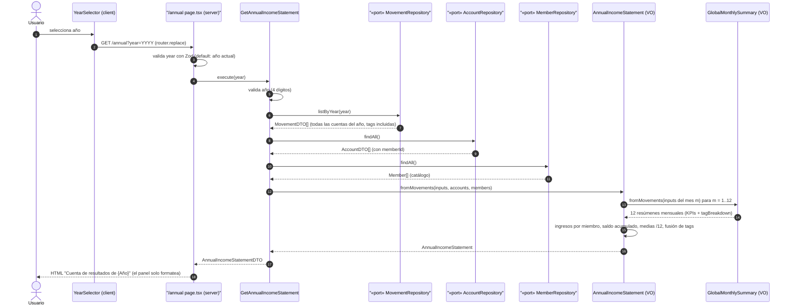

# Implementation Plan: Cuenta de Resultados Anual

**Branch**: `feature/009-cuenta-resultados-anual` | **Date**: 2026-09-23 | **Spec**: [spec.md](./spec.md)

**Input**: Feature specification from `/specs/009-cuenta-resultados-anual/spec.md`

## Summary

Vista anual de análisis familiar equivalente al Excel «Cuenta Resultados»: para el año seleccionado, tabla mensual (Ene–Dic) con ingresos desglosados por miembro y cuenta común, total de ingresos, gasto real, gasto sin gastos personales, saldo del mes y saldo acumulado (running total desde enero, FR-012), cada fila con total anual y media mensual (total/12); y desglose de gastos por tag con un mes por columna, totales anuales y medias. Extensión multimes del resumen global de 006: cada mes coincide al céntimo con `/summary` del mismo mes (FR-006). Feature de **solo lectura**: sin escrituras, sin cambios de esquema ni migraciones (FR-008).

Enfoque técnico (detalles y alternativas en [research.md](./research.md)):
- **Cálculo en el dominio por composición**: VO `AnnualIncomeStatement` cuya factory particiona los movimientos del año por mes y compone **12 × `GlobalMonthlySummary`** (que a su vez compone `MonthlyClosure`): la coherencia FR-006 queda garantizada estructuralmente y clavada con test de invariante. El VO añade en pasas propias lo único nuevo: la **atribución de ingresos por miembro** (dueño de la cuenta de pago; bucket «Cuenta común»; una fila por miembro del catálogo), el **saldo acumulado** (running total desde enero) y las **medias mensuales** (total/12 con redondeo al céntimo).
- **Lectura propia del año**: nuevo método de puerto `MovementRepository.listByYear(year)` (una query con rango `[YYYY-01-01, (YYYY+1)-01-01)`); cuentas vía `AccountRepository.findAll()` y catálogo de miembros vía `MemberRepository.findAll()`. Caso de uso `GetAnnualIncomeStatement` autocontenido, como `GetGlobalMonthlySummary` en 006.
- **Vista propia `/annual?year=`**: adaptador server fino con searchParams validados por Zod (patrón ADR 0008), selector de año nuevo (`year-selector.tsx`, análogo al de mes) y panel servidor `annual-statement-panel.tsx` con dos tablas semánticas (tabla mensual y desglose por tag) en contenedor con scroll horizontal; enlace «Cuenta de resultados» desde la pantalla principal (único cambio en `/`), preservando el año del mes activo.
- **Testing**: tests del VO (incluida la invariante FR-006: cada mes = resumen global de 006), del caso de uso con dobles, del repositorio contra libsql `:memory:`, RTL de componentes y e2e Playwright con año propio (2027) y registro solo en la cuenta de Miembro B, para no contaminar los balances históricos que afirman otras specs.

## Technical Context

**Language/Version**: TypeScript 5.x en modo estricto sobre Node.js LTS; Next.js (App Router) estable actual.

**Primary Dependencies**: las ya fijadas por 002 (next, react, drizzle-orm 0.44.x, @libsql/client, zod, tailwindcss + shadcn/ui copiado en el repo). **Cero dependencias nuevas**.

**Storage**: sin cambios — SQLite/Turso vía Drizzle (esquema de 002/003 intacto; la cuenta de resultados es una vista derivada y no se persiste nada, FR-008).

**Testing**: Vitest (projects node/ui, co-localizados con el SUT) y Playwright (nueva spec e2e `cuenta-resultados-anual.spec.ts`). Patrones de 005/006.

**Target Platform**: Web (escritorio y móvil), Vercel + Turso; sin cambios.

**Project Type**: web-app (monolito Next.js, App Router); sin proyectos ni paquetes nuevos; una ruta nueva (`/annual`).

**Performance Goals**: FR-011 — vista anual de un año con hasta 12 × 300 movimientos < 3 s; una única query `listByYear` (escaneo de tabla a escala familiar, sub-milisegundo) + agregación en memoria de ≤ 3.600 movimientos; sin índice nuevo (FR-008 prohíbe migraciones; research §3).

**Constraints**: aritmética exacta en céntimos enteros sin coma flotante, salvo la única división de la media (total/12) con redondeo al céntimo más próximo (FR-003/FR-009, ADR 0007; research §4); UI en español (FR-010); solo gastos en el desglose por tag (FR-004); sin persistencia nueva (FR-008).

**Scale/Scope**: 1 usuario, ~100–500 movimientos/mes, 1 ruta nueva + 1 enlace en `/`, 1 VO de dominio nuevo + 1 método de puerto + 1 caso de uso + 2 componentes + 3 helpers de formato.

## Constitution Check

*GATE: Must pass before Phase 0 research. Re-check after Phase 1 design.*

| # | Principio | Estado pre-diseño | Notas |
|---|-----------|-------------------|-------|
| I | Simplicidad Primero | ✅ PASS | Sin dependencias ni proyectos nuevos; un método de puerto nuevo y una ruta nueva justificadas por el producto (vista de ámbito anual distinto del mensual). El cálculo reutiliza `GlobalMonthlySummary`/`MonthlyClosure` por composición en lugar de duplicarlos. |
| II | Spec-Driven Development | ✅ PASS | Este plan deriva de `specs/009-cuenta-resultados-anual/spec.md` (Draft, sin marcadores pendientes; las clarificaciones de saldo acumulado y media /12 quedaron resueltas el 2026-09-23). |
| III | Calidad Verificada | ✅ PASS | Lógica de negocio (VO `AnnualIncomeStatement`, incluida la invariante FR-006: cada mes = resumen global de 006) con tests unitarios; caso de uso con dobles; repositorio contra libsql `:memory:`; componentes con RTL; e2e Playwright con cifras exactas en un año propio; gates de CI existentes. |
| IV | TypeScript Estricto + Zod en fronteras | ✅ PASS | Única frontera nueva: `searchParams.year` de `/annual`, validada con Zod (`/^\d{4}$/`). Sin `any`; VO y DTOs tipados. |
| V | Persistencia SQLite con Drizzle | ✅ PASS | Sin cambios de esquema ni migraciones (FR-008): único cambio de persistencia es un método de lectura más en el adaptador Drizzle existente. |
| VI | Producto en español, código en inglés | ✅ PASS | Etiquetas exactas en contracts/ui-contract.md §3 («Cuenta de resultados de {Año}», «Saldo acumulado», «Sin gastos personales», «Media mensual», «Total año»...); identificadores en inglés con ampliación del glosario (`AnnualIncomeStatement`, `listByYear`, `memberIncomeRows`). |
| VII | Hexagonal + DDD Táctico | ✅ PASS | El cálculo es dominio puro (VO que compone 12 VOs con `Money`); el método `listByYear` se define en el puerto de la aplicación y lo implementa el adaptador Drizzle; la UI solo formatea. Sin CQRS/EDA/eventos. |

**Resultado**: sin violaciones → Phase 0 autorizada.

## Project Structure

### Documentation (this feature)

```text
specs/009-cuenta-resultados-anual/
├── plan.md                     # This file (/speckit.plan command output)
├── research.md                 # Phase 0 output (/speckit.plan command)
├── data-model.md               # Phase 1 output (/speckit.plan command)
├── quickstart.md               # Phase 1 output (/speckit.plan command)
├── contracts/
│   └── ui-contract.md          # Contrato de la ruta /annual, el panel y el enlace en /
└── tasks.md                    # Phase 2 output (/speckit.tasks command - NOT created by /speckit.plan)
```

### Source Code (repository root)

```text
├── src/
│   ├── domain/                          # Núcleo puro (cero dependencias externas)
│   │   └── movement/
│   │       ├── AnnualIncomeStatement.ts        # NUEVO: VO cuenta de resultados anual (compone 12 GlobalMonthlySummary + ingresos por miembro + saldo acumulado + medias /12)
│   │       └── AnnualIncomeStatement.test.ts   # NUEVO: tests del VO, incluida la invariante FR-006 (TDD)
│   ├── application/                     # Casos de uso + puertos (depende solo de domain)
│   │   └── movement/
│   │       ├── dto.ts                   # AMPLIADO: AnnualIncomeStatementDTO + filas (MemberIncomeRowDTO, MonthlyTotalsRowDTO, AnnualTagRowDTO, AccumulatedBalanceRowDTO)
│   │       ├── MovementRepository.ts          # AMPLIADO: listByYear(year)
│   │       ├── GetAnnualIncomeStatement.ts     # NUEVO: cuenta de resultados del año vía puertos (movimientos + cuentas + miembros)
│   │       └── GetAnnualIncomeStatement.test.ts # NUEVO
│   ├── app/
│   │   ├── page.tsx                           # AMPLIADO: enlace "Cuenta de resultados" (único cambio en /)
│   │   └── annual/
│   │       └── page.tsx                       # NUEVO: adaptador server fino (searchParams year con Zod)
│   └── infrastructure/
│       ├── db/
│       │   ├── DrizzleMovementRepository.ts   # AMPLIADO: listByYear (rango [YYYY-01-01, año siguiente))
│       │   └── DrizzleMovementRepository.test.ts # AMPLIADO: listByYear contra libsql :memory:
│       └── primary/
│           └── ui/
│               ├── format.ts                    # AMPLIADO: currentYear, buildYearWindow, MONTH_SHORT_LABELS
│               ├── year-selector.tsx            # NUEVO: selector de año cliente reutilizable
│               ├── year-selector.test.tsx       # NUEVO (jsdom + RTL)
│               ├── annual-statement-panel.tsx   # NUEVO: componente servidor del panel (tabla mensual + desglose por tag)
│               └── annual-statement-panel.test.tsx # NUEVO (jsdom + RTL)
├── e2e/
│   └── cuenta-resultados-anual.spec.ts    # NUEVO: cifras exactas del año 2027 registrado en Miembro B (año/cuenta propios)
└── docs/architecture/
    ├── adr/0013-cuenta-resultados-anual-composicion-resumenes.md  # NUEVO (fase implementación)
    ├── overview.md                        # AMPLIADO (fase implementación)
    └── diagrams/                          # AMPLIADO: dominio, C4 y secuencia (fase implementación)
```

**Structure Decision**: misma estructura por capas concéntricas que 002/005/006 (`docs/architecture/overview.md`): dominio y aplicación módulos puros; `src/app/annual/page.tsx` adaptador inbound fino (patrón ADR 0008 de searchParams); UI en `src/infrastructure/primary/ui/`. Tests co-localizados con su SUT; e2e en `e2e/` (spec nueva, serie dentro del fichero por estado compartido de BD, año 2027 y cuenta de Miembro B propios, sin colisión con 002/003/005/006 — ver research §7). **No se tocan** `schema/`, `drizzle/` ni Server Actions: la cuenta de resultados consume `MovementRepository`, `AccountRepository` y `MemberRepository` existentes (más el nuevo método de lectura).

## Diagramas de diseño

Foto del diseño de esta feature (mermaid, como la documentación viva del proyecto); `docs/architecture/diagrams/` se extiende en la fase de implementación reutilizándolos como base. El diagrama de clases del modelo vive en [data-model.md §1.6](./data-model.md).

### Componentes que intervienen

```mermaid
flowchart LR
    U((Usuario))

    subgraph Inbound["Adaptadores inbound — src/app, src/infrastructure/primary"]
        Enlace["Enlace 'Cuenta de resultados' en / (page.tsx, ampliado)"]
        AnnualPage["/annual page.tsx (server; valida year con Zod)"]
        YearSelector["YearSelector (client, router.replace)"]
        Panel["AnnualStatementPanel (server; solo formatea)"]
    end

    subgraph Aplicacion["Capa de aplicación — src/application"]
        UC["GetAnnualIncomeStatement"]
        PortMov["«port» MovementRepository"]
        PortAcc["«port» AccountRepository"]
        PortMem["«port» MemberRepository"]
    end

    subgraph Dominio["Dominio puro — src/domain"]
        VO["AnnualIncomeStatement (VO nuevo)"]
        GMS["GlobalMonthlySummary (VO de 006)"]
        Cierre["MonthlyClosure (VO de 005)"]
    end

    subgraph Outbound["Adaptadores outbound — src/infrastructure/db"]
        DrizzleMov["DrizzleMovementRepository (+ listByYear)"]
        DrizzleAcc["DrizzleAccountRepository"]
        DrizzleMem["DrizzleMemberRepository"]
        LibSQL[("SQLite / Turso (libSQL)")]
    end

    U --> Enlace
    U --> YearSelector
    YearSelector -- "/annual?year=YYYY" --> AnnualPage
    Enlace -- "/annual?year={año del mes activo}" --> AnnualPage
    AnnualPage --> UC : "execute(year)"
    UC --> PortMov : "listByYear(year)"
    UC --> PortAcc : "findAll()"
    UC --> PortMem : "findAll()"
    DrizzleMov -. implementa .-> PortMov
    DrizzleAcc -. implementa .-> PortAcc
    DrizzleMem -. implementa .-> PortMem
    DrizzleMov --> LibSQL
    DrizzleAcc --> LibSQL
    DrizzleMem --> LibSQL
    UC --> VO : "fromMovements(inputs, accounts, members)"
    VO --> GMS : "fromMovements ×12 (una por mes)"
    GMS --> Cierre : "fromMovements"
    AnnualPage --> Panel : "AnnualIncomeStatementDTO"
```

> Nota: las dependencias apuntan siempre hacia el dominio (constitución VII): la página (adaptador) depende del caso de uso, el caso de uso de los puertos (aplicación) y del VO (dominio), y los adaptadores Drizzle implementan los puertos.

### Secuencia — happy path de GetAnnualIncomeStatement



## Complexity Tracking

> **Fill ONLY if Constitution Check has violations that must be justified**

| Violation | Why Needed | Simpler Alternative Rejected Because |
|-----------|------------|-------------------------------------|
| (ninguna) | — | — |

**Decisiones de diseño que requieren ADR en la fase de implementación** (recogido aquí para que `/speckit.tasks` lo incluya):
- **ADR 0013 — Cuenta de resultados anual por composición de resúmenes mensuales**: `AnnualIncomeStatement` particiona el año por mes y delega cada mes en `GlobalMonthlySummary.fromMovements` (que compone `MonthlyClosure`): FR-006 (coherencia al céntimo con 006) queda como garantía estructural + test de invariante. El VO añade la atribución de ingresos por miembro (identidad `memberId`, catálogo de `MemberRepository`; bucket «Cuenta común»), el saldo acumulado desde enero (FR-012) y las medias mensuales (total/12, redondeo al céntimo). Lectura del año vía nuevo método de puerto `listByYear`; vista en ruta propia `/annual`. Alternativas rechazadas en research.md §1–§6 (sumar DTOs de 006 en la aplicación, VO con bucles propios duplicando reglas, 12 × `listByMonth`, agregación SQL).

## Constitution Check (post-diseño, Phase 1)

Re-evaluación tras generar [research.md](./research.md), [data-model.md](./data-model.md), [contracts/ui-contract.md](./contracts/ui-contract.md) y [quickstart.md](./quickstart.md):

| # | Principio | Estado post-diseño | Notas |
|---|-----------|--------------------|-------|
| I | Simplicidad Primero | ✅ PASS | 8 ficheros nuevos de código + 4 ampliaciones puntuales; reutilización por composición (12 × `GlobalMonthlySummary`) y helpers existentes (`format.ts`, patrones de 006); alternativas rechazadas en research.md §1–§6. |
| II | Spec-Driven Development | ✅ PASS | Cada FR-001..FR-012 traza a un artefacto: FR-001/002/007/010 → ui-contract §1–§3; FR-002/003/012 → data-model §1.1 (filas, medias, acumulado); FR-004/005 → data-model §1.1 + ui-contract §2/§3; FR-006 → data-model §1.1 invariante 2 + research §1; FR-008 → §2 (sin DDL); FR-009 → §3 + research §4; FR-011 → §2.1 + research §3. |
| III | Calidad Verificada | ✅ PASS | quickstart.md define la verificación manual de los 8 escenarios (E1–E8); tests por capa (VO con invariante FR-006, use case, repo libsql, RTL) + e2e con cifras exactas en CI y aislamiento documentado (research §7). |
| IV | TypeScript Estricto + Zod | ✅ PASS | Frontera nueva acotada: `year` en `/annual` con Zod (ui-contract §1.1); VO/DTOs tipados; sin `any`. |
| V | SQLite con Drizzle | ✅ PASS | Cero cambios de esquema/migraciones (FR-008 verificado: no hay DDL en el plan; solo un método de lectura del adaptador). |
| VI | Español / inglés | ✅ PASS | Etiquetas y textos exactos en contracts/ui-contract.md §3; glosario ampliado en data-model.md §5 («Saldo acumulado» = `accumulatedBalanceRow`, «Cuenta de resultados» = `/annual`...). |
| VII | Hexagonal + DDD Táctico | ✅ PASS | Cálculo en dominio puro (VO compone 12 VO con `Money`); `listByYear` nace en el puerto de aplicación y lo implementa Drizzle (data-model §2.1); la UI solo formatea (§3: dónde vive cada regla). Sin CQRS/EDA/eventos. |

**Resultado**: diseño aprobado; sin desviaciones que justificar. El plan queda listo para `/speckit.tasks`.
