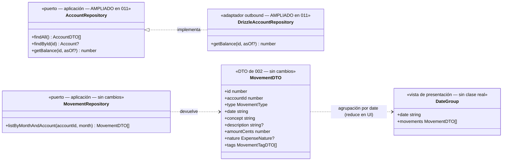

# Data Model: Página de Cuenta

**Feature**: `011-pagina-cuenta` | **Fecha**: 2026-09-27

Feature de presentación: **sin cambios** en entidades, VOs, tablas, índices ni migraciones (FR-009). Los únicos toques de código no-UI son la **firma del puerto `AccountRepository.getBalance`** (parámetro opcional `asOf`) con su implementación Drizzle, y dos helpers puros de calendario en `format.ts`. Las entidades de 002 (Miembro, Cuenta, Movimiento, Tag) siguen siendo la única fuente de verdad ([data-model de 002](../002-registro-movimientos/data-model.md)).

---

## 1. Vista de Dominio

### 1.1 Sin cambios

No hay entidades ni VOs nuevos ni modificados. Se reutilizan tal cual: `Money` (ADR 0007), `Movement`, `MovementType`, `ExpenseNature`, `MonthlyClosure` (005, para el panel de cierre vía `GetMonthlyClosure`), `Account`, `Tag`, `Member` e IDs ([002 §1](../002-registro-movimientos/data-model.md), [005 §1.1](../005-cierre-mensual/data-model.md)).

La **agrupación por fecha** del listado NO es un concepto de dominio ni de aplicación: es una vista calculada en el componente de UI sobre el orden que ya devuelve `ListMovements` (`date DESC, id DESC`) — FR-002 la califica expresamente de presentación (research §3).

### 1.2 Agrupación por fecha (vista de presentación, sin modelo nuevo)

El cálculo vive en `GroupedMovementList` (client) como `reduce` puro sobre `MovementDTO[]` ya ordenado:

```text
groupMovementsByDate(movements: MovementDTO[]): { date: string; movements: MovementDTO[] }[]
```

- **Precondición** (garantizada por `ListMovements` → `listByMonthAndAccount`, `ORDER BY date DESC, id DESC`): la entrada llega ordenada por fecha descendente y, dentro de cada fecha, por registro más reciente primero.
- **Postcondición**: los grupos aparecen en orden de aparición (fecha más reciente arriba) y el orden interno de cada grupo es el de la entrada (último registrado primero). No reordena, no calcula importes, no agrega.
- Invariante verificable en tests de UI: aplanar `groups.flatMap(g => g.movements)` === entrada.

### 1.3 Diagrama de clases (diseño)

Foto del diseño de esta feature; la documentación viva del modelo de dominio (`docs/architecture/diagrams/domain-model.md`) no cambia (no hay piezas de dominio nuevas).



> `DateGroup` se muestra con estereotipo «vista de presentación» para dejar constancia de que **no existe** como tipo exportado de dominio/aplicación: es la forma intermedia del componente.

### 1.4 Errores de dominio

Ninguno nuevo. La política 404 (`notFound()`) es del adaptador inbound (Next), no un error de dominio. Las validaciones de formato de mes siguen lanzando `Error` desde los casos de uso existentes (`ListMovements`, `GetMonthlyClosure`), que la página no puede alcanzar porque valida `month` con Zod antes de llamarlas.

### 1.5 Transiciones de estado

Ninguna: la página es de lectura + delegación en las Server Actions existentes de 002/003.

---

## 2. Vista de Persistencia (Drizzle, SQLite/Turso)

**Sin cambios de esquema ni migraciones** ([data-model de 002 §2](../002-registro-movimientos/data-model.md)). Único cambio en el contrato de puerto + adaptador:

### 2.1 Puerto `AccountRepository` (ampliación, src/application/account/AccountRepository.ts)

```text
- getBalance(id: AccountId): Promise<number>
+ getBalance(id: AccountId, asOf?: string): Promise<number>
```

> **Formato de `asOf`**: fecha ISO `YYYY-MM-DD` **inclusive** (computan los movimientos con `date <= asOf`). `undefined` = histórico total (semántica anterior, usada por `/`). La derivación del «último día del mes consultado» la hace la página con `monthEndIsoDate(month)` — el puerto no conoce meses (research §2).

### 2.2 Implementación `DrizzleAccountRepository.getBalance` (ampliación)

La query agregada existente añade, solo cuando llega `asOf`:

```text
where: eq(movements.accountId, id) [+ lte(movements.date, asOf)]
```

Misma agregación (`sum` con signo por `type`, `coalesce` 0) y mismo `Money.fromCentsOrZero`. Cobertura del índice existente `(account_id, date)`: `eq + lte` es sargable — sin índice nuevo (FR-009).

**Invariantes (tests contra libsql `:memory:`)**:

1. `getBalance(id)` sin corte = histórico total (regresión de 002).
2. `getBalance(id, asOf)` incluye el movimiento fechado **exactamente** el `asOf` (corte inclusive).
3. `getBalance(id, asOf)` excluye los movimientos con fecha > `asOf`.
4. `getBalance(id, asOf)` sobre cuenta sin movimientos ≤ `asOf` = 0 (no null, no NaN).

---

## 3. Validación por capa (dónde vive cada regla)

| Regla | Frontera (Zod) | Aplicación | Dominio | DB | UI (adaptador) |
|---|---|---|---|---|---|
| `accountId` de la ruta (`/^\d+$/` + existencia en catálogo; si no → `notFound()`) | ✅ `src/app/accounts/[accountId]/page.tsx` | — | — | — | — |
| `month` de la URL (`/^\d{4}-(0[1-9]|1[0-2])$/`; inválido/ausente → mes actual) | ✅ ídem | — | — | — | — |
| Existencia de la cuenta | — | ✅ implícita vía `ListAccounts` + `find` en la página | — | — | — |
| Orden del listado (`date DESC, id DESC`) | — | ✅ `ListMovements` (contrato existente) | — | ✅ `listByMonthAndAccount` (regresión cubierta por tests de 002) | — |
| Agrupación por fecha (grupos desc, interno por registro desc) | — | — | — | — | ✅ `reduce` en `GroupedMovementList` (FR-002: presentación) |
| Nota de fila = concepto + « · » + descripción (si existe) | — | — | — | — | ✅ presentación (hasta 014) |
| Balance acumulado hasta fin de mes | — | — | — | ✅ `getBalance(id, asOf)` (corte inclusive) | — |
| Derivación de fin de mes (`monthEndIsoDate`) y mes previo/siguiente (`shiftMonth`) | — | — | — | — | ✅ `format.ts` (helpers puros, testeados) |
| › deshabilitado en mes ≥ actual (nunca futuro desde UI) | — | — | — | — | ✅ `MonthStepper` (comparación léxica `YYYY-MM`) |
| Cierres/KPIs del mes | — | ✅ `GetMonthlyClosure` (005, intacto) | ✅ `MonthlyClosure` | — | — |
| Escrituras (alta/edición/eliminación) | ✅ esquemas de las Server Actions de 002/003 | ✅ casos de uso existentes | ✅ | ✅ | — |
| Revalidación de `/accounts/[accountId]` tras escritura | — | — | — | — | ✅ Server Actions (patrón `"page"`) |
| Formato es-ES EUR, colores, `<time>`, tabular-nums | — | — | — | — | ✅ `format.ts` + clases Tailwind |

La UI **nunca calcula** dinero: agrupa, concatena texto y formatea (constitución VII; el único cálculo monetario sigue siendo la agregación SQL del repositorio, ADR 0009).

---

## 4. DTOs de aplicación

**Sin cambios.** La página consume `AccountDTO[]`, `MovementDTO[]`, `TagDTO[]` y `MonthlyClosureDTO` tal cual (dto.ts de 002/005). No se añaden DTOs: la agrupación por fecha es interna del componente y no cruza la frontera de aplicación.

---

## 5. Glosario ES ↔ EN (ampliación del glosario de 002/005)

| Español (UI/spec) | English (código) | Notas |
|---|---|---|
| Página de cuenta | `/accounts/[accountId]` | `src/app/accounts/[accountId]/page.tsx`; searchParam `month` |
| Balance acumulado hasta el mes consultado | `getBalance(id, asOf?)` | Corte inclusive por fecha (`asOf` = `YYYY-MM-DD`); `undefined` = histórico total |
| Fin de mes | `monthEndIsoDate(month)` | Helper puro en `format.ts` (`2026-04` → `2026-04-30`) |
| Mes anterior/siguiente | `shiftMonth(month, delta)` | Helper puro en `format.ts`; usados por `MonthStepper` |
| Listado agrupado por fecha | `GroupedMovementList` | Componente cliente nuevo; agrupa `MovementDTO[]` ordenado |
| Grupo de fecha | `DateGroup` (solo forma interna) | `{ date, movements }` — vista de presentación, no clase exportada |
| Selector ‹ mes/año › | `MonthStepper` | Componente cliente nuevo (‹ › + picker) |
| Nota de la fila (concepto · descripción) | (presentación) | Interina hasta la fusión de `014-formulario-nota-tags` |
| Distintivo de naturaleza | (presentación) | «Personal»/«Común» solo en gastos; ingresos sin naturaleza |
