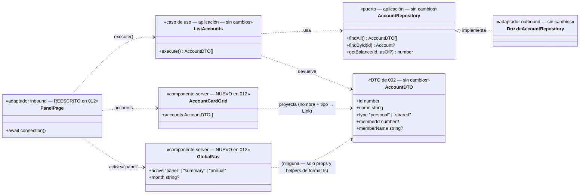

# Data Model: Panel de Cuentas

**Feature**: `012-panel-cuentas` | **Fecha**: 2026-09-29

Feature de presentación pura: **sin cambios** en entidades, VOs, DTOs, puertos, tablas, índices ni migraciones (FR-006). No se añade ningún tipo nuevo de dominio o aplicación; las únicas piezas nuevas son dos componentes de presentación (`GlobalNav`, `AccountCardGrid`) y la reescritura de la página `/`. Las entidades de 002 (Miembro, Cuenta, Movimiento, Tag) siguen siendo la única fuente de verdad ([data-model de 002](../002-registro-movimientos/data-model.md)).

---

## 1. Vista de Dominio

### 1.1 Sin cambios

No hay entidades ni VOs nuevos ni modificados. Se reutilizan tal cual: `Account`, `AccountType` (personal/shared), `Member`, `Money`, `Movement` y el resto del modelo de 002–005 ([002 §1](../002-registro-movimientos/data-model.md)). **Cero modificaciones** en `src/domain/` (FR-006).

### 1.2 La tarjeta del panel (vista de presentación, sin modelo nuevo)

La tarjeta es una proyección directa de `AccountDTO`; no hay cálculo ni estado:

```text
accountCardLabel(account: AccountDTO): string
// "Cuenta común"                         si type === "shared"
// `Cuenta personal de ${memberName ?? "miembro"}`  si type === "personal"
```

- Misma expresión que usa hoy el subtítulo de la página de cuenta (011) y que usaba el selector jubilado: presentación pura, sin lógica de negocio (constitución VII).
- Sin datos derivados: ni balance ni cierre por cuenta en esta ruta (FR-002); la consulta financiera vive en `/accounts/[id]` (011) y `/summary` (006).

### 1.3 Diagrama de clases (diseño)

Foto del diseño de esta feature; la documentación viva del modelo (`docs/architecture/diagrams/domain-model.md`) no cambia (no hay piezas de dominio nuevas).



> `GlobalNav` y `AccountCardGrid` se muestran como clases de presentación para dejar constancia de sus props de diseño; **no** son piezas de dominio ni aplicación. `GlobalNav` depende solo de `format.ts` (`currentMonth`), nunca de datos de la BD.

### 1.4 Errores de dominio

Ninguno nuevo. `/` siempre tiene datos que mostrar (las cuentas vienen del catálogo); el caso «cero cuentas» no puede darse con el seed (3 cuentas) y la rejilla vacía simplemente renderiza una lista vacía — no se diseña UI específica para lo imposible (I, YAGNI). Los 404 de `/accounts/[id]` siguen siendo de 011, sin cambios.

### 1.5 Transiciones de estado

Ninguna: la ruta es de lectura (`connection()` → `ListAccounts` → render); toda escritura sigue ocurriendo en las Server Actions de 002/003 desde la página de cuenta.

---

## 2. Vista de Persistencia (Drizzle, SQLite/Turso)

**Sin cambios**: cero DDL, cero migraciones, cero queries nuevas (FR-006). El panel consume exclusivamente `ListAccounts → AccountRepository.findAll()` (la misma lectura del selector jubilado). `revalidatePath("/")` en las Server Actions de 002/003 se conserva tal cual (excepción declarada en FR-006): sin efecto sobre movimientos, sigue siendo el mecanismo que mantendría al día el panel ante futuras altas de cuentas.

---

## 3. Validación por capa (dónde vive cada regla)

| Regla | Frontera (Zod) | Aplicación | Dominio | DB | UI (adaptador) |
|---|---|---|---|---|---|
| Dinamismo por petición (cuentas actuales siempre) | ✅ `await connection()` en `/` (semántica de request, no schema) | — | — | — | — |
| `?month=` residual en `/` se ignora | ✅ por diseño: la página no lee `searchParams` | — | — | — | — |
| Orden de tarjetas (id ascendente, determinista) | — | ✅ contrato de `ListAccounts`/`findAll` | — | ✅ `ORDER BY id` existente | — |
| Etiqueta de tipo («Cuenta común» / «Cuenta personal de {miembro}») | — | — | — | — | ✅ presentación pura de `AccountDTO` |
| Enlace de tarjeta → `/accounts/{id}` sin mes | — | — | — | — | ✅ `AccountCardGrid` (la página de destino aplica mes actual) |
| Navegación global con estado activo (`aria-current`) | — | — | — | — | ✅ `GlobalNav` (prop `active` de la página) |
| Propagación del mes visible a `/summary`/`/annual` | — | — | — | — | ✅ `GlobalNav({ month? })` + `currentMonth()` por defecto; `/annual` pasa `${year}-01` |
| Sin datos financieros en el panel | — | — | — | — | ✅ solo se consultan cuentas (FR-002) |
| Escrituras (alta/edición/eliminación) | ✅ schemas existentes de las Server Actions | ✅ casos de uso existentes | ✅ | ✅ | — (vía `/accounts/[id]`, sin cambios) |
| Textos es-ES; importes solo donde ya existían | — | — | — | — | ✅ `format.ts` intacto |

La UI **nunca calcula** dinero y en esta ruta ni siquiera lo consulta: el panel es un lanzador (constitución VII; decisión del propietario 2026-09-29).

---

## 4. DTOs de aplicación

**Sin cambios.** El panel consume `AccountDTO[]` de `ListAccounts` tal cual (dto.ts de 002). No se añaden DTOs: nombre y tipo ya viajan en el DTO (`name`, `type`, `memberName`).

---

## 5. Glosario ES ↔ EN (ampliación del glosario de 002/011)

| Español (UI/spec) | English (código) | Notas |
|---|---|---|
| Panel de cuentas | `PanelPage` / ruta `/` | `src/app/page.tsx` reescrito; `await connection()` |
| Tarjeta de cuenta | `AccountCardGrid` | Componente server; una tarjeta-Link por `AccountDTO` |
| Lanzador puro | (decisión de producto) | Tarjeta con nombre+tipo, sin datos financieros |
| Navegación global | `GlobalNav` | Componente server; props `active` y `month?` |
| Destino activo | `active: "panel" \| "summary" \| "annual"` | Se pinta con `aria-current="page"` |
| Contexto temporal | `month?: string` | Prop de `GlobalNav`; `currentMonth()` por defecto |
| Mes visible | (heredado de 011) | `?month=YYYY-MM` de la página de cuenta |
| Combobox «Cuenta activa» | (jubilado) | `account-month-selector.tsx` eliminado con la pasarela |
| Listado plano de `/` | (jubilado) | `movement-list.tsx` eliminado; `GroupedMovementList` único listado |
