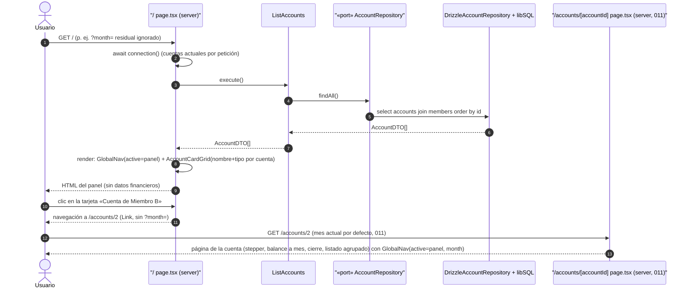

# Implementation Plan: Panel de Cuentas

**Branch**: `feature/012-panel-cuentas` | **Date**: 2026-09-29 | **Spec**: [spec.md](./spec.md)

**Input**: Feature specification from `/specs/012-panel-cuentas/spec.md`

## Summary

`/` se convierte en el **panel de cuentas**: una tarjeta lanzadora por cuenta (nombre y tipo, **sin datos financieros** — decisión del propietario 2026-09-29) que navega en un clic a `/accounts/[id]`, y una **navegación global persistente** (Panel · Resumen global · Cuenta de resultados) presente en el 100% de las páginas, que sustituye los navs locales duplicados y conserva el mes visible al navegar (clarificación 2026-09-29). La página de cuenta (011) pierde cualquier puerta de cambio de cuenta; `movement-list.tsx` y `account-month-selector.tsx` se jubilan con la antigua pasarela. Feature de presentación pura: sin cambios de dominio, aplicación, puertos ni persistencia (FR-006); las 6 specs e2e existentes se adaptan a la nueva puerta de entrada sin debilitar aserciones (FR-005).

Enfoque técnico (detalles y alternativas en [research.md](./research.md)):
- **`GlobalNav({ active, month? })` de servidor** renderizado por las 4 páginas (no en `layout.tsx`: los layouts no reciben `searchParams` y la variante cliente exigiría `Suspense`); estado activo con `aria-current="page"`; propagación del mes por prop con `currentMonth()` por defecto (research §1–§2).
- **Panel dinámico**: `await connection()` en la nueva `/` sin leer `searchParams` (cuentas actuales siempre; `?month=` residual ignorado) (research §3).
- **`AccountCardGrid`**: rejilla responsiva `sm:2/lg:3`, un `Link`-tarjeta por `AccountDTO` en orden de `ListAccounts`, solo nombre + tipo (research §4).
- **Jubilaciones**: `MovementList` y `AccountMonthSelector` (+ tests) eliminados; `revalidatePath("/")` de las acciones verificado (FR-006) (research §5).
- **E2E**: helper `openAccount` (panel → cuenta) en las 6 specs existentes con sus aserciones intactas; nueva `panel-cuentas.spec.ts` de lectura pura (research §6).

## Technical Context

**Language/Version**: TypeScript 5.x en modo estricto sobre Node.js LTS; Next.js 16 (App Router).

**Primary Dependencies**: las ya fijadas por 002 (next, react, drizzle-orm, @libsql/client, zod, tailwindcss + shadcn/ui copiado en el repo). **Cero dependencias nuevas.**

**Storage**: sin cambios — SQLite/Turso vía Drizzle (esquema de 002/003 intacto); el panel solo lee `ListAccounts`.

**Testing**: Vitest (projects node/ui, co-localizados) y Playwright (6 specs adaptadas + `panel-cuentas.spec.ts` nueva). Patrones de 011.

**Target Platform**: Web (escritorio primero; usable en móvil), Vercel + Turso; sin cambios.

**Project Type**: web-app (monolito Next.js, App Router); sin proyectos ni paquetes nuevos; una página reescrita, dos componentes nuevos.

**Performance Goals**: SC-003 — panel con las 3 cuentas < 1 s (una única lectura de catálogo; holgado respecto al SC-004 del maestro).

**Constraints**: UI en español; sin datos financieros en `/`; sin cambios de dominio/aplicación/persistencia (FR-006); `/summary` y `/annual` funcionalmente intactos (FR-003); e2e sin debilitar aserciones (FR-005).

**Scale/Scope**: 1 usuario, 3+ cuentas; 1 página reescrita + 2 componentes server nuevos (+tests RTL) + 3 páginas con nav sustituido + 2 componentes jubilados; 6 specs e2e adaptadas + 1 nueva.

## Constitution Check

*GATE: Must pass before Phase 0 research. Re-check after Phase 1 design.*

| # | Principio | Estado pre-diseño | Notas |
|---|-----------|-------------------|-------|
| I | Simplicidad Primero | ✅ PASS | Cero dependencias/proyectos nuevos: 2 componentes de presentación, 1 página reescrita, sustitución de navs; sin estado global ni contexto de cliente (la nav lee props, no la URL). Alternativas de nav evaluadas y rechazadas en research §1. |
| II | Spec-Driven Development | ✅ PASS | Este plan deriva de `specs/012-panel-cuentas/spec.md` (Draft con clarificación 2026-09-29: conservar mes visible en la navegación global). Feature hija única del roadmap (fila 012), presentación sobre 002/003/005/011. |
| III | Calidad Verificada | ✅ PASS | Componentes con RTL (nav activo/enlaces con mes, tarjetas); 6 specs e2e adaptadas a la nueva puerta **sin debilitar aserciones** (FR-005) y spec nueva del panel; flujo crítico de registro sigue e2e (constitución III). |
| IV | TypeScript Estricto + Zod en fronteras | ✅ PASS | Sin fronteras de datos nuevas: el panel no lee `searchParams`; las validaciones Zod existentes de `/accounts/[id]`, `/summary`, `/annual` y las acciones quedan intactas. Sin `any`. |
| V | Persistencia SQLite con Drizzle | ✅ PASS | Cero cambios de esquema, queries y migraciones (FR-006): lectura única `ListAccounts` → `findAll` existente. |
| VI | Producto en español, código en inglés | ✅ PASS | Textos exactos en contracts/ui-contract.md §5 («Panel», «Navegación principal», «Cuentas», tarjetas); identificadores en inglés con glosario en data-model §5 (`GlobalNav`, `AccountCardGrid`, `active`). |
| VII | Arquitectura Hexagonal + DDD Táctico | ✅ PASS | Dominio y aplicación intactos (FR-006); la UI consume `ListAccounts` y proyecta `AccountDTO` sin cálculo (FR-002); `currentMonth` ya vive en `format.ts` (adaptador). Sin CQRS/EDA/eventos. |

**Resultado**: sin violaciones → Phase 0 autorizada.

## Project Structure

### Documentation (this feature)

```text
specs/012-panel-cuentas/
├── plan.md                     # This file (/speckit.plan command output)
├── research.md                 # Phase 0 output (/speckit.plan command)
├── data-model.md               # Phase 1 output (/speckit.plan command)
├── quickstart.md               # Phase 1 output (/speckit.plan command)
├── contracts/
│   └── ui-contract.md          # Contrato del panel, la tarjeta y la navegación global
└── tasks.md                    # Phase 2 output (/speckit.tasks command - NOT created by /speckit.plan)
```

### Source Code (repository root)

```text
├── src/
│   ├── application/                      # SIN CAMBIOS (FR-006): ListAccounts y puertos intactos
│   ├── domain/                           # SIN CAMBIOS (FR-006)
│   ├── app/
│   │   ├── layout.tsx                    # INTACTO (Toaster/metadata; la nav no vive aquí — research §1)
│   │   ├── page.tsx                      # REESCRITO: panel (connection() + ListAccounts + GlobalNav + AccountCardGrid)
│   │   ├── accounts/
│   │   │   └── [accountId]/
│   │   │       └── page.tsx              # AMPLIADO: nav local → GlobalNav active="panel" month={month}
│   │   ├── summary/
│   │   │   └── page.tsx                  # AMPLIADO: nav local → GlobalNav active="summary" month={month}
│   │   └── annual/
│   │       └── page.tsx                  # AMPLIADO: nav local → GlobalNav active="annual" month={`${year}-01`}
│   └── infrastructure/
│       └── primary/
│           ├── actions/                  # INTACTOS: revalidatePath("/") verificado, sin cambios (FR-006)
│           └── ui/
│               ├── global-nav.tsx             # NUEVO: nav server (active, month?) + aria-current
│               ├── global-nav.test.tsx        # NUEVO (jsdom + RTL)
│               ├── account-card-grid.tsx      # NUEVO: rejilla server de tarjetas-Link
│               ├── account-card-grid.test.tsx # NUEVO (jsdom + RTL)
│               ├── movement-list.tsx          # ELIMINADO (+ test): jubilado con la pasarela
│               ├── movement-list.test.tsx     # ELIMINADO
│               ├── account-month-selector.tsx # ELIMINADO (+ test): selector jubilado
│               └── account-month-selector.test.tsx # ELIMINADO
├── e2e/
│   ├── registro-movimientos.spec.ts      # ADAPTADO: openAccount por el panel; fila de 011 (Común, sin «Gasto»)
│   ├── edicion-movimientos.spec.ts       # ADAPTADO: openAccount + stepper
│   ├── cierre-mensual.spec.ts            # ADAPTADO: openAccount
│   ├── resumen-global.spec.ts            # ADAPTADO: openAccount + nav global con mes
│   ├── cuenta-resultados-anual.spec.ts   # ADAPTADO: openAccount + nav global con año
│   ├── pagina-cuenta.spec.ts             # ADAPTADO: P8 retirado (pasarela congelada); P1–P7 intactos
│   └── panel-cuentas.spec.ts             # NUEVO: panel, un clic, nav global, edge cases (lectura pura)
└── docs/architecture/
    ├── overview.md                       # AMPLIADO (fase implementación): / como panel, nav global
    └── diagrams/                         # AMPLIADO (fase implementación): reutilizando estos diagramas
```

**Structure Decision**: misma estructura por capas concéntricas que 002–011 (`docs/architecture/overview.md`). Sin tocar `src/domain/` ni `src/application/` (FR-006). Los componentes nuevos son **server components** en `src/infrastructure/primary/ui/` (presentación sin JS de cliente); la página `/` queda como adaptador fino de una única lectura. Tests co-localizados; e2e en `e2e/` respetando `workers: 1` y las combinaciones cuenta/mes existentes (research §6).

## Diagramas de diseño

Foto del diseño de esta feature (mermaid, como la documentación viva del proyecto); `docs/architecture/diagrams/` se extiende en la fase de implementación reutilizándolos como base. El diagrama de clases del modelo vive en [data-model.md §1.3](./data-model.md) (no hay piezas de dominio nuevas).

### Componentes que intervienen

```mermaid
flowchart LR
    U((Usuario))

    subgraph Inbound["Adaptadores inbound — src/app, src/infrastructure/primary"]
        Panel["/ page.tsx (server; connection() + ListAccounts)"]
        AccPage["/accounts/[accountId] page.tsx (server, 011)"]
        SumPage["/summary page.tsx (server, 006)"]
        AnnPage["/annual page.tsx (server, 009)"]
        GNav["GlobalNav (server, NUEVO: Panel · Resumen · Anual; aria-current)"]
        Cards["AccountCardGrid (server, NUEVO: tarjetas-Link)"]
    end

    subgraph Aplicacion["Capa de aplicación — src/application"]
        LA["ListAccounts"]
        PortAcc["«port» AccountRepository"]
    end

    subgraph Outbound["Adaptadores outbound — src/infrastructure/db"]
        DrizzleAcc["DrizzleAccountRepository"]
        LibSQL[("SQLite / Turso (libSQL)")]
    end

    U -->|"GET /"| Panel
    U -->|"clic tarjeta"| Cards
    Panel --> GNav
    Panel --> Cards
    AccPage --> GNav : "active=panel, month"
    SumPage --> GNav : "active=summary, month"
    AnnPage --> GNav : "active=annual, year→month"
    Panel --> LA
    AccPage --> LA
    LA --> PortAcc : "findAll()"
    DrizzleAcc -. implementa .-> PortAcc
    DrizzleAcc --> LibSQL
    Cards -->|"Link /accounts/{id}"| AccPage
    GNav -->|"/summary?month= · /annual?year="| SumPage
    GNav -->|"/annual?year="| AnnPage
```

> Nota: dependencias siempre hacia el dominio (constitución VII); en esta feature el dominio no cambia: el panel y la nav son presentación pura (`GlobalNav` no consulta datos; `AccountCardGrid` proyecta DTOs sin cálculo).

### Secuencia — happy path: abrir el panel y entrar a una cuenta



## Complexity Tracking

> **Fill ONLY if Constitution Check has violations that must be justified**

| Violation | Why Needed | Simpler Alternative Rejected Because |
|-----------|------------|-------------------------------------|
| (ninguna) | — | — |

**Decisiones de diseño destacadas (sin violación, registradas para `/speckit.tasks`)**:
- **`GlobalNav` de servidor renderizado por página** (no en `layout.tsx`, no cliente): los layouts no reciben `searchParams` (se perdería la propagación del mes, US2-4) y la variante cliente con `useSearchParams` exigiría `<Suspense>` y rompería la página 404 estática (research §1).
- **`await connection()` en `/`**: sin él, Next 16 prerenderizaría el panel en build y congelaría las cuentas; `connection()` es la semántica de request recomendada (research §3).
- **Jubilación de `movement-list` y `account-month-selector`**: solo los consumía la pasarela; 011 ya anticipó su retiro. `GroupedMovementList` queda como único listado (research §5).
- **`/annual` pasa `${year}-01` a la nav**: paridad exacta con su nav local actual (clarificación 2026-09-29); «Panel» enlaza siempre a `/` sin query (research §2).

## Constitution Check (post-diseño, Phase 1)

Re-evaluación tras generar [research.md](./research.md), [data-model.md](./data-model.md), [contracts/ui-contract.md](./contracts/ui-contract.md) y [quickstart.md](./quickstart.md):

| # | Principio | Estado post-diseño | Notas |
|---|-----------|--------------------|-------|
| I | Simplicidad Primero | ✅ PASS | 2 componentes server nuevos (+tests RTL), 1 página reescrita, 3 navs sustituidos, 2 componentes jubilados (neto negativo en superficie de UI); sin deps/estado global/hooks de navegación. Alternativas rechazadas en research §1–§4. |
| II | Spec-Driven Development | ✅ PASS | Cada FR traza a un artefacto: FR-001 → ui-contract §1 + research §4; FR-002 → research §3/§4 + data-model §3; FR-003 → ui-contract §2 + research §1/§2; FR-004 → ui-contract §3; FR-005 → research §6 + quickstart gates; FR-006 → data-model §2 (cero cambios); FR-007 → ui-contract §5. |
| III | Calidad Verificada | ✅ PASS | quickstart con 7 escenarios (N1–N7) + gates; RTL de los 2 componentes (aria-current, hrefs con mes, tarjetas); 6 specs e2e adaptadas sin debilitar aserciones + `panel-cuentas.spec.ts` nueva; flujo crítico de registro cubierto vía panel (FR-005). |
| IV | TypeScript Estricto + Zod | ✅ PASS | Sin fronteras nuevas (el panel no lee parámetros); Zod intacto en rutas y acciones existentes; props tipadas (`active: "panel" \| "summary" \| "annual"`, `month?: string`); sin `any`. |
| V | SQLite con Drizzle | ✅ PASS | Cero DDL/queries nuevas (FR-006 verificado: la única lectura es `findAll` existente; `revalidatePath("/")` conservado sin cambios). |
| VI | Español / inglés | ✅ PASS | Textos exactos en ui-contract §5; glosario en data-model §5 (`GlobalNav`, `AccountCardGrid`, `active`, lanzador puro); sin términos intraducibles nuevos. |
| VII | Hexagonal + DDD Táctico | ✅ PASS | Dominio y aplicación intactos; `GlobalNav` no consulta datos; `AccountCardGrid` proyecta `AccountDTO` sin cálculo (FR-002); etiqueta de tipo = presentación (data-model §1.2). Sin CQRS/EDA/eventos. |

**Resultado**: diseño aprobado; sin desviaciones que justificar. El plan queda listo para `/speckit.tasks`.
