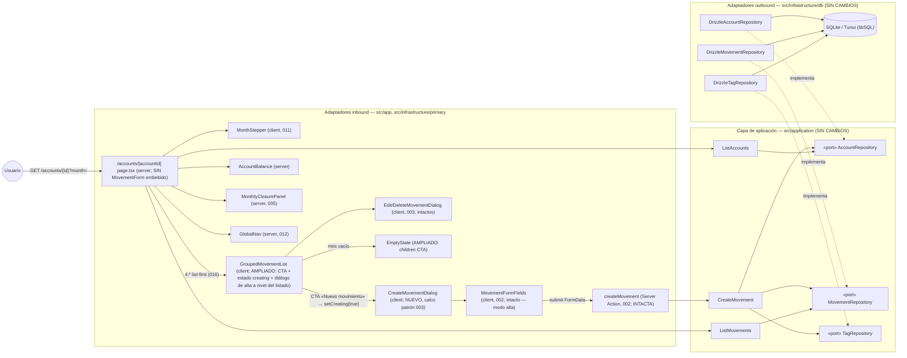
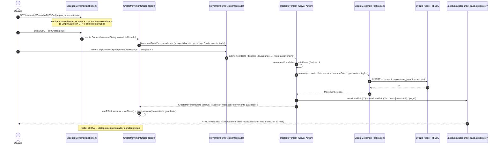

# Implementation Plan: Formulario de alta en diálogo desde el listado

**Branch**: `feature/013-formulario-dialogo` | **Date**: 2026-09-30 | **Spec**: [spec.md](./spec.md)

**Input**: Feature specification from `/specs/013-formulario-dialogo/spec.md`

## Summary

La página de cuenta (`/accounts/[accountId]?month=`) pasa a ser **lectura por defecto, escritura bajo demanda**: el bloque de alta embebido (`MovementForm`, 002) desaparece y la sección del listado gana un CTA **«Nuevo movimiento»** que abre un **diálogo con el formulario de alta** — mismos campos, valores por defecto, reglas y mensajes de validación que hoy, presentado con el patrón de diálogo entregado por 003 (`EditMovementDialog`). Al guardar con éxito el diálogo se cierra con toast «Movimiento guardado» y la revalidación existente recalcula listado, balance y cierre; ante errores de campo permanece abierto con los valores conservados; cancelar descarta sin efectos. Cierra el rediseño list-first iniciado en 016 (FR-004 sustituye deliberadamente el FR-002 de aquella).

Feature de **presentación pura** (FR-005): un componente nuevo (`CreateMovementDialog`), ampliaciones a `GroupedMovementList` y `EmptyState`, y la eliminación del wrapper embebido en `page.tsx`. Sin cambios de dominio, aplicación, Server Actions, validación, persistencia ni migraciones. El CTA está disponible en cualquier mes visible, incluidos los vacíos (FR-001); la cuenta queda fijada a la de la página (FR-002); los tests del flujo de alta se adaptan al nuevo punto de entrada sin debilitar lo que verifican y el flujo crítico sigue cubierto por e2e (FR-006, constitución III).

Enfoque técnico (detalles y alternativas en [research.md](./research.md)):
- **Diálogo calco de `edit-movement-dialog.tsx`** con `createMovement` y `MovementFormFields` en modo alta (cuenta fijada, fecha hoy); montado a nivel de `GroupedMovementList` con estado `creating`, nunca en una fila (research §1).
- **CTA en dos puntos del listado**: cabecera de la sección «Movimientos del mes» y junto al estado vacío (`EmptyState` con texto actualizado) — garantiza FR-001 en meses vacíos (research §1/§2).
- **Pruebas**: test RTL nuevo del diálogo (molde `edit-movement-dialog.test.tsx`), ampliación de las del listado, re-point de las del wrapper eliminado y helpers e2e que abren el diálogo antes de rellenar + aserción de ausencia del bloque embebido (research §3).
- **Documentación viva**: diagrama de secuencia de la página de cuenta, `overview.md` y fila 013 del roadmap maestro actualizados en la implementación (research §4).

## Technical Context

**Language/Version**: TypeScript 5.x en modo estricto sobre Node.js LTS; Next.js 16 (App Router).

**Primary Dependencies**: las ya fijadas por 002 (next, react, drizzle-orm, @libsql/client, zod, tailwindcss + shadcn/ui copiado en el repo, sonner). **Cero dependencias nuevas.**

**Storage**: sin cambios — SQLite/Turso vía Drizzle (esquema, queries y migraciones intactos); el alta sigue siendo `createMovement` → `CreateMovement` (002) sin consultas nuevas (FR-005).

**Testing**: Vitest (projects node/ui, co-localizados) — test RTL nuevo `create-movement-dialog.test.tsx`, `grouped-movement-list.test.tsx` ampliado, `movement-form.test.tsx` re-apuntado; Playwright — los 6 helpers e2e de alta (`registro-movimientos`, `pagina-cuenta`, `edicion-movimientos`, `cierre-mensual`, `resumen-global`, `cuenta-resultados-anual`) abren el diálogo antes de rellenar; aislamiento por cuenta/mes y `workers: 1` intactos (FR-006).

**Target Platform**: Web (escritorio primero; usable en móvil), Vercel + Turso; sin cambios.

**Project Type**: web-app (monolito Next.js, App Router); sin proyectos ni paquetes nuevos; 1 componente nuevo, 2 ampliados, 1 wrapper eliminado de la página.

**Performance Goals**: SC-004 — la página sin formulario embebido reduce su altura visible: selector + listado + CTA alcanzables con menos desplazamiento en viewport de escritorio estándar. SC-001 — alta completa en una interacción continua (abrir → rellenar → guardar → ver), sin recarga ni salida de la página.

**Constraints**: UI en español (FR-007); sin cambios de dominio/aplicación/persistencia/datos ni migraciones (FR-005); diálogos a nivel del listado, nunca en filas (FR-005, convención AGENTS.md); `/`, `/summary`, `/annual` y navegación global sin cambios (FR-007); suites en verde tras adaptar el punto de entrada sin debilitar verificaciones (FR-006).

**Scale/Scope**: 1 usuario, 3 cuentas; 1 página modificada, 1 componente nuevo (+test), 2 componentes ampliados (+tests), 1 wrapper eliminado, 6 specs e2e con helper actualizado; documentación viva y roadmap actualizados.

## Constitution Check

*GATE: Must pass before Phase 0 research. Re-check after Phase 1 design.*

| # | Principio | Estado pre-diseño | Notas |
|---|-----------|-------------------|-------|
| I | Simplicidad Primero | ✅ PASS | 1 componente nuevo que calca un patrón existente (003), reutilizando `MovementFormFields` y la action sin tocarlas; se **elimina** código (wrapper embebido). Sin abstracciones, estado global ni dependencias nuevas (FR-005). |
| II | Spec-Driven Development | ✅ PASS | Este plan deriva de `specs/013-formulario-dialogo/spec.md` (fila 013 del roadmap maestro, reducida al CTA tras 016). Feature hija de una única US con valor propio; sustitución deliberada del FR-002 de 016 documentada en la propia spec. |
| III | Calidad Verificada | ✅ PASS | El flujo crítico de registro sigue cubierto por e2e con el nuevo punto de entrada (FR-006, constitución III); CTA y diálogo con cobertura RTL (apertura, alta feliz, error, cancelación); gates lint/typecheck/test/e2e en verde. |
| IV | TypeScript Estricto + Zod en fronteras | ✅ PASS | Sin fronteras de datos nuevas: el `FormData` del diálogo valida con el mismo `movementFormSchema` (Zod); sin `any`; `CreateMovementState` intacto. |
| V | Persistencia SQLite con Drizzle | ✅ PASS | Cero cambios de esquema, repos, consultas y migraciones (FR-005): mismas cinco lecturas de la página y misma escritura `CreateMovement`. |
| VI | Producto en español, código en inglés | ✅ PASS | Textos nuevos en español («Nuevo movimiento», estado vacío actualizado); identificadores nuevos en inglés (`CreateMovementDialog`, `creating`). Formateo EUR es-ES vía helpers existentes (FR-007). |
| VII | Arquitectura Hexagonal + DDD Táctico | ✅ PASS | Dominio y aplicación intactos; la página sigue siendo un adaptador inbound fino y todo el cambio vive en `src/infrastructure/primary/ui` (adaptadores de presentación). La UI consume la aplicación (action → caso de uso) sin duplicar lógica. Sin CQRS/EDA/eventos. |

**Resultado**: sin violaciones → Phase 0 autorizada.

## Project Structure

### Documentation (this feature)

```text
specs/013-formulario-dialogo/
├── plan.md                     # This file (/speckit.plan command output)
├── research.md                 # Phase 0 output (/speckit.plan command)
├── data-model.md               # Phase 1 output (/speckit.plan command)
├── quickstart.md               # Phase 1 output (/speckit.plan command)
├── contracts/
│   └── ui-contract.md          # Contrato del CTA, estado vacío y diálogo de alta
└── tasks.md                    # Phase 2 output (/speckit.tasks command - NOT created by /speckit.plan)
```

### Source Code (repository root)

```text
├── src/
│   ├── application/                      # SIN CAMBIOS (FR-005): casos de uso y puertos intactos (CreateMovement incluido)
│   ├── domain/                           # SIN CAMBIOS (FR-005)
│   ├── app/
│   │   ├── layout.tsx                    # INTACTO (Toaster sonner ya montado)
│   │   ├── page.tsx                      # INTACTO (FR-007)
│   │   ├── summary/page.tsx              # INTACTO (FR-007)
│   │   ├── annual/page.tsx               # INTACTO (FR-007)
│   │   └── accounts/
│   │       └── [accountId]/
│   │           └── page.tsx              # MODIFICADO: sin bloque MovementForm (FR-004); pasa accountName/accountType a GroupedMovementList
│   └── infrastructure/
│       ├── db/                            # INTACTO (FR-005): schema, repos, migraciones
│       └── primary/
│           ├── actions/                   # INTACTAS (FR-005): create-movement.action, movement-form.schema y revalidatePath sin cambios
│           └── ui/
│               ├── create-movement-dialog.tsx      # NUEVO: diálogo de alta (calco de edit-movement-dialog con createMovement)
│               ├── create-movement-dialog.test.tsx # NUEVO: RTL (apertura/defaults, éxito cierra+tuesta, error permanece, cancelar)
│               ├── grouped-movement-list.tsx       # AMPLIADO: estado creating + CTA «Nuevo movimiento» en cabecera y estado vacío + render del diálogo a nivel del listado
│               ├── grouped-movement-list.test.tsx  # AMPLIADO: CTA visible con/sin movimientos, abre el diálogo, copy del vacío
│               ├── empty-state.tsx                # AMPLIADO: children para el CTA + texto «Pulsa «Nuevo movimiento»…»
│               ├── movement-form.tsx              # REFACTORIZADO: se elimina el wrapper MovementForm (embebido); MovementFormFields y MovementFormInitialValues intactos
│               ├── movement-form.test.tsx         # ADAPTADO: tests del wrapper re-apuntados al diálogo / a MovementFormFields en modo alta; tests de modo edición intactos
│               └── edit-movement-dialog.tsx (+test) # INTACTOS (003)
├── e2e/
│   ├── registro-movimientos.spec.ts      # AMPLIADO: helper registerMovement abre el CTA+diálogo antes de rellenar (flujo crítico, constitución III)
│   ├── pagina-cuenta.spec.ts             # AMPLIADO: helper actualizado + aserción de ausencia del bloque embebido (FR-004); adyacencia stepper→listado intacta
│   ├── edicion-movimientos.spec.ts       # AMPLIADO: helper de setup abre el diálogo del CTA
│   ├── cierre-mensual.spec.ts            # AMPLIADO: helper actualizado
│   ├── resumen-global.spec.ts            # AMPLIADO: helper actualizado (3 altas)
│   ├── cuenta-resultados-anual.spec.ts   # AMPLIADO: helper actualizado (5 altas)
│   └── panel-cuentas.spec.ts             # INTACTO (aserta ausencia de «Registrar» en /; sigue siendo cierta)
├── specs/001-family-wallet/spec.md       # ACTUALIZADO (implementación): estado de la fila 013
└── docs/architecture/
    ├── overview.md                       # AMPLIADO (implementación): composición de la página de cuenta sin formulario embebido
    └── diagrams/
        └── pagina-cuenta-sequence.md     # ACTUALIZADO (implementación): alta vía diálogo en lugar de bloque embebido
```

**Structure Decision**: misma estructura por capas concéntricas que 002–016 (`docs/architecture/overview.md`). Todo el cambio vive en el adaptador inbound de UI (`src/infrastructure/primary/ui`) más la composición de la página; dominio, aplicación, acciones y persistencia intactos (FR-005). El diálogo se monta a nivel de `GroupedMovementList` (convención de diálogos del proyecto). Tests co-localizados; e2e respetando `workers: 1` y las combinaciones cuenta/mes asignadas a cada spec.

## Diagramas de diseño

Foto del diseño de esta feature (mermaid, como la documentación viva del proyecto); `docs/architecture/diagrams/` se extiende en la fase de implementación reutilizándolos como base. El diagrama de clases del modelo vive en [data-model.md §1.3](./data-model.md) (no hay piezas de dominio nuevas: la feature es presentación pura).

### Componentes que intervienen



> Nota: dependencias siempre hacia el dominio (constitución VII); **ni el dominio ni la aplicación cambian**. `CreateMovementDialog` es el único componente nuevo y consume la misma Server Action de 002; `GroupedMovementList` monta todos los diálogos (alta/edición/eliminación) a nivel del listado, nunca en filas (FR-005, convención AGENTS.md). Tras guardar, `createMovement` revalida `/` y `/accounts/[accountId]`, `page` → la server page se recalcula completa y el diálogo (client) sobrevive al refresco mientras esté montado.

### Secuencia — happy path: registrar un movimiento desde el CTA



## Complexity Tracking

> **Fill ONLY if Constitution Check has violations that must be justified**

| Violation | Why Needed | Simpler Alternative Rejected Because |
|-----------|------------|-------------------------------------|
| (ninguna) | — | — |

**Decisiones de diseño destacadas (sin violación, registradas para `/speckit.tasks`)**:
- **`CreateMovementDialog` calco de `EditMovementDialog`** con `createMovement` y `MovementFormFields` en modo alta: reutiliza el patrón probado de 003 (diálogo controlado sin `DialogTrigger`, éxito cierra + toast, errores de campo no cierran, Cancelar sin confirmación) sin duplicar campos (FR-002/FR-003) (research §1).
- **Sin `formKey` de remonte en el diálogo**: el wrapper embebido remontaba el formulario tras cada éxito para permitir altas encadenadas; el diálogo se cierra tras guardar y se desmonta, así que cada reapertura ya es un formulario limpio (edge case «registros consecutivos») (research §1).
- **CTA en cabecera del listado + estado vacío**: el estado vacío se renderiza dentro de `GroupedMovementList` (convención); `EmptyState` pasa a aceptar el CTA para que el alta nunca sea inaccesible en meses vacíos (FR-001, escenario 5) (research §1/§2).
- **Helpers e2e abren el diálogo antes de rellenar**: los labels/botones del formulario son idénticos y únicos en la página, por lo que los helpers solo añaden la apertura (`button «Nuevo movimiento»` → `dialog «Nuevo movimiento»`); se añade aserción de ausencia del bloque embebido en `pagina-cuenta.spec.ts` P1 para congelar FR-004 sin debilitar nada (research §3).

## Constitution Check (post-diseño, Phase 1)

Re-evaluación tras generar [research.md](./research.md), [data-model.md](./data-model.md), [contracts/ui-contract.md](./contracts/ui-contract.md) y [quickstart.md](./quickstart.md):

| # | Principio | Estado post-diseño | Notas |
|---|-----------|--------------------|-------|
| I | Simplicidad Primero | ✅ PASS | 1 componente nuevo (calco de patrón existente), 2 ampliados, 1 wrapper eliminado, 0 dependencias; el cambio neto mínimo que satisface FR-001–FR-004 sin tocar el flujo de alta (FR-005). |
| II | Spec-Driven Development | ✅ PASS | Cada FR traza a artefacto: FR-001 → ui-contract §1 + research §1/§2; FR-002 → ui-contract §2 + data-model §1.2; FR-003 → ui-contract §3 + data-model §4; FR-004 → ui-contract §1 + research §3 (aserción e2e); FR-005 → data-model §2 + research §5; FR-006 → research §3 + quickstart gates; FR-007 → ui-contract §5. |
| III | Calidad Verificada | ✅ PASS | Quickstart con 5 escenarios (Q1–Q5) + gates; cobertura RTL del diálogo y del CTA (apertura, alta feliz, error, cancelación, mes vacío); los 6 helpers e2e de alta adaptados al nuevo punto de entrada y el flujo crítico de registro sigue cubierto (FR-006, constitución III). |
| IV | TypeScript Estricto + Zod | ✅ PASS | Sin cambios de tipos ni fronteras: `movementFormSchema` y `CreateMovementState` intactos (data-model §3); sin `any`. |
| V | SQLite con Drizzle | ✅ PASS | Cero DDL/queries/migraciones (FR-005 verificado: mismas cinco lecturas + misma escritura). |
| VI | Español / inglés | ✅ PASS | Textos nuevos congelados en ui-contract §1/§2 («Nuevo movimiento», estado vacío, toasts existentes); identificadores nuevos en inglés; glosario del data-model sin términos intraducibles nuevos. |
| VII | Hexagonal + DDD Táctico | ✅ PASS | Dominio y aplicación intactos (data-model §1.1/§2); todo el cambio es composición de adaptadores de presentación que consume la misma action/caso de uso; sin CQRS/EDA/eventos. |

**Resultado**: diseño aprobado; sin desviaciones que justificar. El plan queda listo para `/speckit.tasks`.
