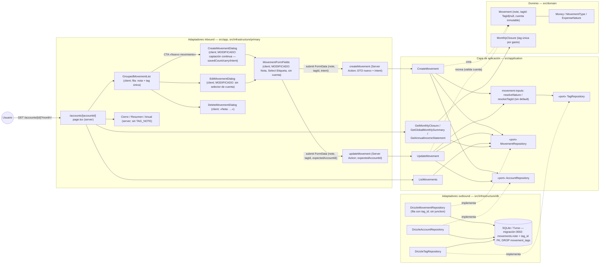

# Implementation Plan: Alta continua de movimientos con formulario simplificado (nota única, tag única y sin campo cuenta)

**Branch**: `feature/014-formulario-nota-tags` | **Date**: 2026-10-01 | **Spec**: [spec.md](./spec.md)

**Input**: Feature specification from `/specs/014-formulario-nota-tags/spec.md`

## Summary

El flujo de alta/edición de movimientos (002/003/013) se simplifica y agiliza para la **captación por lotes** (2-3 tandas al mes): (1) el diálogo de alta pasa a **permanecer abierto tras guardar** («Guardar y seguir» primario), preparando la siguiente captura con nota/importe/etiqueta vacíos, fecha/tipo/naturaleza pegados y foco en la Nota, con «Guardar y cerrar» como acción secundaria; (2) **nota única** que fusiona concepto y descripción en un solo campo obligatorio a través de todo el stack (dominio, DTOs, schema, vistas); (3) **tag única** (0..1) obligatoria en gastos y opcional en ingresos, sin asignación automática de «Sin Clasificar»; (4) **sin campo cuenta** también en edición, que pierde el selector y la posibilidad de mover movimientos entre cuentas (la cuenta queda inmutable tras el alta). La migración elimina los movimientos de prueba existentes y conserva cuentas, miembros y catálogo de tags.

A diferencia de 013 (presentación pura), esta feature **modifica dominio, aplicación y persistencia**: `Movement` (`note`, `tagId: TagId | null`, cuenta inmutable), `resolveTagId` sin default, FK `tag_id` en `movements` con DROP de `movement_tags`, y la Server Action de alta con `intent` de tanda. Enfoque técnico (detalles y alternativas en [research.md](./research.md)):

- **Tag única como FK** `tag_id` en `movements` (RESTRICT) en lugar de tabla de unión (research §2/§5).
- **Captación continua por remonte**: `key={savedCount}` sobre el `<form>` con `carry` (fecha/tipo/naturaleza) como `defaultValue` — el patrón de remonte que ya usaba el wrapper de 002; `intent` (`continue|close`) viaja en el FormData vía botones submit y vuelve en el estado de la action (research §4).
- **Edición sin cuenta**: `expectedAccountId` validado en `UpdateMovement` en lugar de `accountId` editable (research §3).
- **Migración `0002_*` destructiva**: DELETE de movimientos + recreación de tabla; catálogo intacto (research §5).
- **Pruebas**: adaptación integral de fixtures/selectores manteniendo lo verificado; `registro-movimientos.spec.ts` como spec canónica de la tanda continua (research §6).

## Technical Context

**Language/Version**: TypeScript 5.x en modo estricto sobre Node.js LTS; Next.js 16 (App Router).

**Primary Dependencies**: las fijadas por la constitución v1.2.1 (next, react, drizzle-orm ~0.44.7, @libsql/client, zod 4, tailwind + shadcn/ui en el repo, sonner). **Cero dependencias nuevas.**

**Storage**: SQLite (dev) / Turso (prod) vía Drizzle. Esquema `movements` modificado (`note`, `tag_id` FK RESTRICT; fuera `concept`/`description`), tabla `movement_tags` **eliminada**; migración versionada `drizzle/0002_*` que borra los movimientos existentes (SC-003). Repositorio simplificado (sin junction ni `db.batch` de tags, `leftJoin` único).

**Testing**: Vitest (projects node/ui, co-localizados) — dominio (`Movement`, cierres con fixtures de tag única), aplicación (`resolveTagId`, `expectedAccountId`), repositorio (esquema nuevo, `createTestDb` migra), actions (`note`/`tagId`/`intent`, notice de edición) y componentes (tanda continua, errores, edición sin cuenta). Playwright e2e — helpers con «Nota» + selector de etiqueta; `registro-movimientos` cubre tanda + gasto sin tag (FR-007, constitución III); aislamiento cuenta/mes y `workers: 1` intactos.

**Target Platform**: Web (escritorio primero; usable en móvil), Vercel + Turso; sin cambios.

**Project Type**: web-app (monolito Next.js, App Router); sin proyectos ni paquetes nuevos.

**Performance Goals**: SC-001 — una tanda de N movimientos con 1 apertura de diálogo y N envíos, sin clics intermedios; SC-002 — ≤ 6 controles por captura. Sin metas de rendimiento nuevas (1 usuario, 3 cuentas).

**Constraints**: UI en español, importes EUR es-ES (FR-009); solo el alta es continua (FR-006); revalidación en vivo por guardado (FR-005); la estructura de la página, `/`, `/summary`, `/annual` y navegación intactas (FR-009); migración solo por script (convención BD).

**Scale/Scope**: 1 usuario, 3 cuentas; cambios en ~4 ficheros de dominio/aplicación, 3 de persistencia (+migración), 2 actions + schema compartido, 6 componentes UI (+tests co-localizados), 7 specs e2e adaptadas; documentación viva (domain-model, secuencia, overview, ADR 0011 + ADR nuevo) y roadmap maestro (FR-008).

## Constitution Check

*GATE: Must pass before Phase 0 research. Re-check after Phase 1 design.*

| # | Principio | Estado pre-diseño | Notas |
|---|-----------|-------------------|-------|
| I | Simplicidad Primero | ✅ PASS | Simplificación neta del modelo (una columna en lugar de concept+description+junction), reutiliza el patrón de remonte de 002, los RadioGroup existentes (tipo/naturaleza) y el Select shadcn ya en el repo para la etiqueta; sin proyectos, librerías ni capas nuevas. La complejidad de la tanda se resuelve con HTML estándar (`intent` en botones submit). |
| II | Spec-Driven Development | ✅ PASS | Este plan deriva de `specs/014-formulario-nota-tags/spec.md` (fila 014 del maestro, refundida por el propietario 2026-10-01). Agrupa 2 US por decisión del propietario documentada en la spec (excepción de granularidad, mismo criterio que 003). Las enmiendas al maestro quedan registradas como FR-008. |
| III | Calidad Verificada | ✅ PASS | Lógica de negocio nueva (tag por tipo, cuenta inmutable) cubierta por tests de dominio/aplicación; flujo crítico de registro sigue e2e **incluida la tanda continua y el error por tag ausente** (FR-007, exigencia explícita de constitución III); migración destructiva verificada por tests de repositorio (SC-003/SC-004). |
| IV | TypeScript Estricto + Zod | ✅ PASS | Frontera `movementFormSchema` actualizada (`note`, `tagId` 0..1, `superRefine` de tag en gastos, `intent`); DTOs tipados sin `any`; sin fronteras nuevas más allá de las existentes. |
| V | Persistencia SQLite con Drizzle | ✅ PASS | Esquema evoluciona solo por migración versionada `drizzle/0002_*` generada con drizzle-kit (única vía); FK con integridad referencial; sin SQL ad-hoc fuera de migraciones. |
| VI | Producto en español, código en inglés | ✅ PASS | Literales nuevos en español congelados en el ui-contract («Nota», «Etiqueta», «Guardar y seguir», «La nota es obligatoria.», …); identificadores en inglés (`note`, `tagId`, `carry`, `intent`); glosario actualizado (data-model §5). `Intl` es-ES sigue solo en `format.ts` (intacto). |
| VII | Arquitectura Hexagonal + DDD táctico | ✅ PASS | La regla de tag por tipo vive en la entidad `Movement` (dominio puro, sin deps); `resolveTagId` en aplicación; repositorio/action como adaptadores; la UI no duplica lógica (solo lee `state`). Sin puertos nuevos, sin CQRS/EDA/eventos. |

**Resultado**: sin violaciones → Phase 0 autorizada.

## Project Structure

### Documentation (this feature)

```text
specs/014-formulario-nota-tags/
├── plan.md                     # This file (/speckit.plan command output)
├── research.md                 # Phase 0 output (/speckit.plan command)
├── data-model.md               # Phase 1 output (/speckit.plan command)
├── quickstart.md               # Phase 1 output (/speckit.plan command)
├── contracts/
│   └── ui-contract.md          # Contrato UI + FormData/Server Action (nota, tag única, tanda)
└── tasks.md                    # Phase 2 output (/speckit.tasks command - NOT created by /speckit.plan)
```

### Source Code (repository root)

```text
├── src/
│   ├── domain/
│   │   ├── movement/
│   │   │   ├── Movement.ts             # MODIFICADO: note (fusiona concept/description), tagId: TagId|null (obligatoria en gastos), MovementInput/Persistence nuevas
│   │   │   ├── Movement.test.ts        # ADAPTADO: fixtures note, regla de tag por tipo
│   │   │   └── MovementErrors.ts       # MODIFICADO: MovementField ("note", "tagId"; fuera "concept"/"tagIds")
│   │   ├── closure/
│   │   │   ├── MonthlyClosure.ts       # MODIFICADO: ClosureMovementInput.tag único (cálculo intacto)
│   │   │   └── MonthlyClosure.test.ts  # ADAPTADO: fixtures tag única
│   │   ├── summary/ y annual/          # MODIFICADOS (+tests): inputs de composición con tag única
│   │   ├── movement/Money.ts (+test)   # INTACTOS (ADR 0007)
│   │   └── tag/                        # INTACTO (catálogo; sin cambios de forma)
│   ├── application/
│   │   └── movement/
│   │       ├── dto.ts                  # MODIFICADO: note, tagId (Create/Update), MovementDTO.tag único; UpdateMovementDTO.expectedAccountId
│   │       ├── movement-inputs.ts      # MODIFICADO: resolveTagId sin default (fuera DEFAULT_TAG_SLUG)
│   │       ├── CreateMovement.ts (+test)   # MODIFICADO/ADAPTADO (tagId, sin re-export de DEFAULT_TAG_SLUG)
│   │       ├── UpdateMovement.ts (+test)   # MODIFICADO/ADAPTADO (expectedAccountId, cuenta inmutable)
│   │       ├── GetMonthlyClosure.ts, GetGlobalMonthlySummary.ts, GetAnnualIncomeStatement.ts (+tests) # ADAPTADOS (mapeo tag única)
│   │       └── ListMovements.ts, DeleteMovement.ts (+tests) # ADAPTADOS solo fixtures/tipos
│   ├── app/
│   │   ├── accounts/[accountId]/page.tsx   # MODIFICADO (menor): sin accounts hacia el listado de edición si deja de usarse
│   │   ├── page.tsx, summary/page.tsx, annual/page.tsx, layout.tsx  # INTACTOS (FR-009)
│   └── infrastructure/
│       ├── db/
│       │   ├── schema/movements.ts     # MODIFICADO: note, tag_id FK RESTRICT; fuera concept/description
│       │   ├── schema/movement-tags.ts # ELIMINADO (junto a su export en schema/index.ts)
│       │   ├── DrizzleMovementRepository.ts  # MODIFICADO: insert/update de fila única, leftJoin único
       │   │   ├── DrizzleMovementRepository.test.ts # ADAPTADO + test de migración/RESTRICT (SC-003)
│       │   └── mappers/movement.mapper.ts    # MODIFICADO: sin agrupación multi-tag; DTO con tag único
│       └── primary/
│           ├── actions/
│           │   ├── movement-form.schema.ts  # MODIFICADO: note, tagId 0..1, superRefine tag-gasto, intent; MovementFormValues nuevas
│           │   ├── create-movement.action.ts (+test)  # MODIFICADO: DTO nuevo, success con intent, revalidate intacto
│           │   └── update-movement.action.ts (+test)  # MODIFICADO: expectedAccountId, notice sin rama de cuenta
│           └── ui/
│               ├── movement-form.tsx        # MODIFICADO: campo Nota, Select Etiqueta (placeholder «Selecciona etiqueta», con «Sin etiqueta» en ingresos), sin bloque/selector de cuenta, focus tras remonte, carry
│               ├── movement-form.test.tsx   # ADAPTADO/AMPLIADO
│               ├── create-movement-dialog.tsx      # MODIFICADO: captación continua (savedCount, carry, intent, no cierre en «seguir»)
│               ├── create-movement-dialog.test.tsx # AMPLIADO: tanda, guardar y cerrar, errores
│               ├── edit-movement-dialog.tsx        # MODIFICADO: sin accounts/Select, initialValues con note/tagId
│               ├── edit-movement-dialog.test.tsx   # ADAPTADO
│               ├── grouped-movement-list.tsx (+test) # MODIFICADO: fila con note + tag única; deja de pasar accounts al diálogo de edición
│               ├── delete-movement-dialog.tsx (+test) # MODIFICADO: «Nota: …»
│               ├── monthly-closure-panel.tsx, global-summary-panel.tsx, annual-statement-panel.tsx (+tests) # MODIFICADOS: fuera TAG_NOTE; header «Nota»
│               └── format.ts, empty-state.tsx, navegación, selectores, balance  # INTACTOS
├── drizzle/
│   ├── 0002_<nombre-generado>.sql       # NUEVO: DELETE movimientos + recrear tabla (note, tag_id RESTRICT) + DROP movement_tags
│   └── meta/_journal.json               # ACTUALIZADO (idx 2)
├── e2e/
│   ├── registro-movimientos.spec.ts     # AMPLIADO: tanda continua (1 apertura, N guardados), «Guardar y cerrar», gasto sin tag (error), ingreso sin tag
│   ├── edicion-movimientos.spec.ts      # ADAPTADO: helpers Nota/selector de etiqueta; sin cambio de cuenta (recorrido retirado)
│   ├── cierre-mensual.spec.ts, resumen-global.spec.ts, cuenta-resultados-anual.spec.ts, pagina-cuenta.spec.ts  # ADAPTADOS: helpers Nota + selector de etiqueta única
│   └── panel-cuentas.spec.ts            # INTACTO (verificar literales)
├── scripts/seed.ts, src/infrastructure/db/seed-data.ts  # INTACTOS (catálogo; «Sin Clasificar» permanece)
├── specs/001-family-wallet/spec.md      # ACTUALIZADO (implementación, FR-008): enmiendas + fila 014 «Completada»
└── docs/architecture/
    ├── diagrams/domain-model.md         # ACTUALIZADO (implementación): Movement con note/tagId, relación 0..1, invariantes
    ├── diagrams/registro-movimiento-sequence.md  # ACTUALIZADO: tanda + intent
    ├── overview.md                      # ACTUALIZADO si menciona concept/descripción/multi-tag
    └── adr/
        ├── 0011-…-edicion-reconstruccion.md  # NOTA: la edición ya no mueve de cuenta
        └── 00XX-tag-unica-fk.md         # NUEVO: FK tag_id + migración destructiva (sustituye N:M de 002)
```

**Structure Decision**: misma estructura por capas concéntricas que 002–016 (`docs/architecture/overview.md`). El cambio atraviesa las capas (dominio → aplicación → adaptadores) siguiendo la dirección de dependencias: la regla nueva vive en la entidad; la UI y las actions solo traducen. Tests co-localizados; e2e respetando `workers: 1` y las combinaciones cuenta/mes asignadas.

## Diagramas de diseño

Foto del diseño de esta feature (mermaid, como la documentación viva del proyecto); `docs/architecture/diagrams/` se extiende en la fase de implementación reutilizándolos como base. El diagrama de clases del modelo vive en [data-model.md §1.5](./data-model.md).

### Componentes que intervienen



> Nota: dependencias siempre hacia el dominio (constitución VII). La regla «tag obligatoria en gastos / opcional en ingresos» y la fusión nota viven en `Movement` (dominio puro); `resolveTagId` solo valida existencia/actividad; la UI nunca decide negocio, lee `state`. El contador de tanda (`savedCount`) y los valores pegados (`carry`) son estado local del diálogo (adaptador inbound).

### Secuencia — happy path: tanda continua (guardar y seguir ×2, guardar y cerrar)

```mermaid
sequenceDiagram
    autonumber
    actor U as Usuario
    participant D as CreateMovementDialog (client)
    participant F as MovementFormFields (form key=savedCount)
    participant A as createMovement (Server Action)
    participant CM as CreateMovement (aplicación)
    participant M as Movement (dominio)
    participant DB as DrizzleMovementRepository + libSQL
    participant P as "/accounts/[accountId] page.tsx (server)"

    U->>D: CTA «Nuevo movimiento» (1.ª y única apertura de la tanda)
    D->>F: limpia: fecha hoy, Gasto, sin etiqueta (Guardados oculto)
    U->>F: nota «Mercadona», importe 85,00, Etiqueta «Alimentación» → «Guardar y seguir» (intent=continue)
    F->>A: submit FormData { note, amount, accountId, type, nature, tagId, intent }
    A->>A: movementFormSchema.safeParse (Zod: nota, tagId 0..1, gasto con tag)
    A->>CM: execute(CreateMovementDTO { note, tagId, … })
    CM->>CM: resolveNature + resolveTagId (sin default; existe y activa)
    CM->>M: Movement.create(input) — valida nota/tipo/tag por tipo
    M-->>CM: Movement (tagId obligatoria en gasto ✓)
    CM->>DB: INSERT movements (note, tag_id) — sin junction
    CM-->>A: ok
    A->>P: revalidatePath("/") + revalidatePath("/accounts/[accountId]", "page")
    A-->>D: { status: "success", message: "Movimiento guardado", intent: "continue" }
    D->>D: toast + savedCount=1 + carry={date, type, nature} (NO cierra)
    D->>F: remonta form (key=1): nota/importe/tagId vacíos, fecha/tipo/naturaleza pegados, foco en Nota
    P-->>U: página revalidada: listado/balance/cierre con el movimiento (diálogo abierto encima)
    U->>F: segunda captura → «Guardar y seguir» (repite 3-11; Guardados: 2)
    U->>F: última captura → «Guardar y cerrar» (intent=close)
    A-->>D: { status: "success", intent: "close" }
    D->>D: toast + cierra (onClose)
    P-->>U: página final: tanda completa visible (1 apertura, N envíos — SC-001)
```

## Complexity Tracking

> **Fill ONLY if Constitution Check has violations that must be justified**

| Violation | Why Needed | Simpler Alternative Rejected Because |
|-----------|------------|-------------------------------------|
| (ninguna) | — | — |

**Decisiones de diseño destacadas (sin violación, registradas para `/speckit.tasks`)**:

- **Tag única como FK `tag_id` en `movements`** (ON DELETE RESTRICT) y DROP de `movement_tags`: la materialización mínima de un 0..1; imposible más de una tag por construcción, sin joins ni batch (research §2/§5).
- **Regla tag-por-tipo en la entidad `Movement`** (gasto sin tag → `InvalidMovementError("tagId")`), igual que la de naturaleza: negocio en dominio, no en la UI ni solo en Zod (research §2, constitución VII).
- **Captación continua por remonte `key={savedCount}` + `carry`**: reutiliza el patrón probado del wrapper de 002; los campos siguen no controlados (`defaultValue`), foco programático en Nota tras el remonte (research §4).
- **`intent` en botones submit HTML** («Guardar y seguir»/«Guardar y cerrar») y `intent` devuelto en `CreateMovementState` (default `close`): una sola Server Action, sin JS extra ni segunda action (research §4).
- **`expectedAccountId` en `UpdateMovementDTO`**: check explícito de que el movimiento pertenece a la cuenta de la página en lugar de un `accountId` editable falso; la cuenta queda inmutable (FR-004) (research §3).
- **Migración `0002_*` destructiva**: DELETE de movimientos de prueba + recreación de tabla (sin backfill arbitrario); catálogo/cuentas intactos (SC-003, clarificación 2026-10-01) (research §5).
- **`registro-movimientos.spec.ts` como spec canónica de la tanda**: absorbe la cobertura e2e de captación continua y gasto-sin-tag sin añadir fichero a la cola serial (mismo criterio que 013) (research §6).

## Constitution Check (post-diseño, Phase 1)

Re-evaluación tras generar [research.md](./research.md), [data-model.md](./data-model.md), [contracts/ui-contract.md](./contracts/ui-contract.md) y [quickstart.md](./quickstart.md):

| # | Principio | Estado post-diseño | Notas |
|---|-----------|--------------------|-------|
| I | Simplicidad Primero | ✅ PASS | El diseño elimina más de lo que añade: 2 columnas + tabla junction fuera, un campo y un checkbox-multi→select dentro; la tanda usa estado local + HTML estándar, sin librerías ni abstracciones nuevas (research §1–§5). |
| II | Spec-Driven Development | ✅ PASS | Cada FR traza a artefacto: FR-001 → ui-contract §3/§4 + research §4; FR-002 → data-model §1.2/§2.1 + ui-contract §1; FR-003 → data-model §1.2/§3 + ui-contract §1/§2; FR-004 → data-model §1.2/§4 + research §3; FR-005 → research §4 (revalidate intacto); FR-006 → ui-contract §2; FR-007 → research §6 + quickstart gates; FR-008 → research §7 + Project Structure; FR-009 → ui-contract §8. |
| III | Calidad Verificada | ✅ PASS | Quickstart con 5 escenarios + gates; suites adaptadas manteniendo lo verificado y cobertura nueva donde la feature arriesga (tanda, tag obligatoria, `intent`, migración destructiva); el flujo crítico sigue e2e con tanda y error por tag ausente (SC-004, constitución III). |
| IV | TypeScript Estricto + Zod | ✅ PASS | `movementFormSchema` redefinido con las reglas nuevas (`note`, `tagId` 0..1, superRefine de tag, `intent`); DTOs y estados tipados; sin `any`; todas las fronteras validadas (data-model §3, ui-contract §5). |
| V | SQLite con Drizzle | ✅ PASS | Esquema nuevo solo vía migración versionada `0002_*` generada por drizzle-kit (journal idx 2); FK RESTRICT garantiza integridad; repositorio sin SQL ad-hoc (data-model §2). |
| VI | Español / inglés | ✅ PASS | Literales congelados en el ui-contract («Nota», «Etiqueta», «Sin etiqueta», «Guardar y seguir», «Guardar y cerrar», «Guardados: N», «La nota es obligatoria.», «Selecciona una etiqueta para el gasto.»); identificadores en inglés; glosario ES↔EN actualizado con nota/tagId/intent y concept/description retirados (data-model §5). |
| VII | Hexagonal + DDD táctico | ✅ PASS | La regla de tag por tipo y la nota viven en `Movement` (entidad pura, sin deps externas); `resolveTagId`/`expectedAccountId` en aplicación; repositorio y actions como adaptadores; UI sin lógica de negocio duplicada; sin puertos, eventos, CQRS ni EDA nuevos (data-model §1, diagramas). |

**Resultado**: diseño aprobado; sin desviaciones que justificar. El plan queda listo para `/speckit.tasks`.
