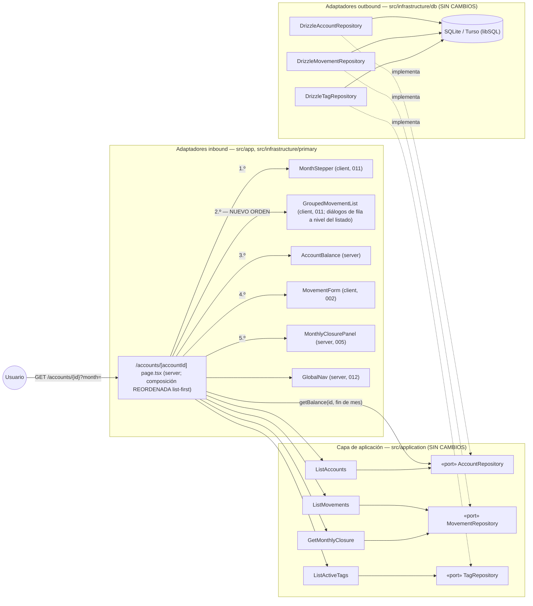
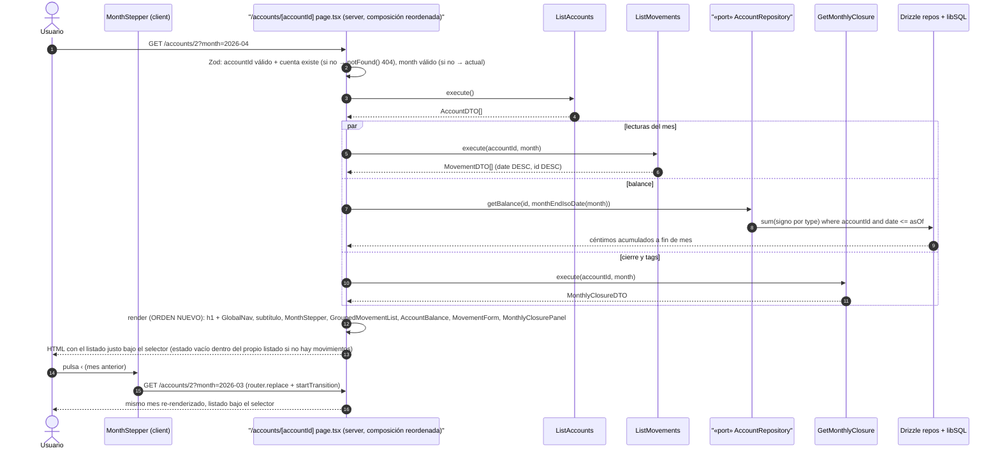

# Implementation Plan: Listado de movimientos bajo el selector de fechas

**Branch**: `feature/016-movimientos-bajo-selector-fechas` | **Date**: 2026-09-30 | **Spec**: [spec.md](./spec.md)

**Input**: Feature specification from `/specs/016-movimientos-bajo-selector-fechas/spec.md`

## Summary

La página de detalle de cuenta (`/accounts/[accountId]?month=`) pasa a ser **list-first**: el listado de movimientos agrupado por fecha se renderiza **inmediatamente debajo del selector de mes/año**, y los bloques restantes (balance acumulado, formulario de alta embebido, cierre mensual) bajan por debajo del listado conservando su orden relativo actual (clarificación 2026-09-29). Orden resultante: cabecera de cuenta → `MonthStepper` → `GroupedMovementList` → `AccountBalance` → `MovementForm` → `MonthlyClosurePanel`. Entrega el «list-first» que la fila 013 del roadmap anticipaba, adelantado como feature propia a petición del propietario.

Feature de **presentación pura**: reordenar bloques existentes en un único fichero (`src/app/accounts/[accountId]/page.tsx`). Sin cambios de dominio, aplicación, puertos, persistencia, datos, migraciones ni consultas (FR-003). Las convenciones del listado (diálogos montados a nivel del listado, estado vacío dentro del propio listado) quedan intactas (FR-004); la funcionalidad previa sigue operativa y las pruebas en verde (FR-005).

Enfoque técnico (detalles y alternativas en [research.md](./research.md)):
- **Reordenación en `page.tsx`**: mover el JSX de `GroupedMovementList` justo tras `MonthStepper`; cero cambios en componentes hijos (research §1).
- **Sin tocar Server Actions ni `revalidatePath`**: el flujo de revalidación tras alta/edición/eliminación recalcula la página completa, incluida la nueva posición del listado (research §2).
- **E2E selectivos, sin specs nuevas**: los e2e existentes usan roles/labels, no posición; solo se añade una aserción de adyacencia selector→listado en `pagina-cuenta.spec.ts` (P1) si el plan lo considera oportuno, reforzando (nunca debilitando) lo que verifica (research §3).
- **Documentación viva**: `docs/architecture/diagrams/pagina-cuenta-sequence.md` y `docs/architecture/overview.md` se actualizan con el nuevo orden (research §4); fila 013 del roadmap maestro actualizada (sin «list-first»).

## Technical Context

**Language/Version**: TypeScript 5.x en modo estricto sobre Node.js LTS; Next.js 16 (App Router).

**Primary Dependencies**: las ya fijadas por 002 (next, react, drizzle-orm, @libsql/client, zod, tailwindcss + shadcn/ui copiado en el repo). **Cero dependencias nuevas.**

**Storage**: sin cambios — SQLite/Turso vía Drizzle (esquema, queries y migraciones intactos); la reordenación no añade lecturas (FR-003).

**Testing**: Vitest (projects node/ui, co-localizados) y Playwright (specs existentes de la página de cuenta). Patrones de 011/012. Los tests RTL de los componentes no dependen del orden de la página y quedan intactos.

**Target Platform**: Web (escritorio primero; usable en móvil), Vercel + Turso; sin cambios.

**Project Type**: web-app (monolito Next.js, App Router); sin proyectos ni paquetes nuevos; una página reordenada.

**Performance Goals**: SC-002 — con viewport de escritorio estándar, selector de fechas y primer grupo de movimientos visibles en la misma pantalla sin desplazamiento (el listado sube por encima de balance/formulario/cierre; el propio stepper ya es compacto).

**Constraints**: UI en español; sin cambios de dominio/aplicación/persistencia/datos (FR-003); convenciones del listado intactas (FR-004); `/`, `/summary`, `/annual` y navegación global sin cambios (FR-006); pruebas existentes en verde, actualizadas solo para reflejar el nuevo orden sin debilitar lo que verifican (FR-005).

**Scale/Scope**: 1 usuario, 3+ cuentas; 1 página (JSX reordenado), 0 componentes nuevos, 0 eliminados; 1 aserción e2e añadida como refuerzo; documentación viva y roadmap actualizados.

## Constitution Check

*GATE: Must pass before Phase 0 research. Re-check after Phase 1 design.*

| # | Principio | Estado pre-diseño | Notas |
|---|-----------|-------------------|-------|
| I | Simplicidad Primero | ✅ PASS | El cambio mínimo posible: reordenar JSX en un único fichero; cero componentes, dependencias o abstracciones nuevas (FR-003). Sin estado global, hooks ni indirección alguna. |
| II | Spec-Driven Development | ✅ PASS | Este plan deriva de `specs/016-movimientos-bajo-selector-fechas/spec.md` (Draft con clarificación 2026-09-29: orden relativo de los bloques restantes). Feature hija única del roadmap (fila 016), presentación sobre 011/012. |
| III | Calidad Verificada | ✅ PASS | Los e2e existentes de la página de cuenta cubren la operativa completa (alta, edición, eliminación, navegación, vacío, 404, month inválido) con roles/labels agnósticos del orden; el plan añade una aserción de adyacencia que **refuerza** el FR-001. Gates lint/typecheck/test en verde (FR-005). |
| IV | TypeScript Estricto + Zod en fronteras | ✅ PASS | Sin fronteras de datos nuevas ni cambios de tipos: la validación Zod de `accountId`/`month` en la página queda intacta; solo se mueve JSX. Sin `any`. |
| V | Persistencia SQLite con Drizzle | ✅ PASS | Cero cambios de esquema, queries, repositorios y migraciones (FR-003): mismas lecturas (`ListAccounts`, `ListMovements`, `getBalance`, `GetMonthlyClosure`, `ListActiveTags`). |
| VI | Producto en español, código en inglés | ✅ PASS | Sin textos ni identificadores nuevos; la página y sus bloques conservan sus textos en español tal cual. |
| VII | Arquitectura Hexagonal + DDD Táctico | ✅ PASS | Dominio y aplicación intactos; la página sigue siendo un adaptador inbound fino que proyecta DTOs existentes. La reordenación es composición de presentación, sin lógica (FR-003). Sin CQRS/EDA/eventos. |

**Resultado**: sin violaciones → Phase 0 autorizada.

## Project Structure

### Documentation (this feature)

```text
specs/016-movimientos-bajo-selector-fechas/
├── plan.md                     # This file (/speckit.plan command output)
├── research.md                 # Phase 0 output (/speckit.plan command)
├── data-model.md               # Phase 1 output (/speckit.plan command)
├── quickstart.md               # Phase 1 output (/speckit.plan command)
├── contracts/
│   └── ui-contract.md          # Contrato de composición/orden de la página de cuenta
└── tasks.md                    # Phase 2 output (/speckit.tasks command - NOT created by /speckit.plan)
```

### Source Code (repository root)

```text
├── src/
│   ├── application/                      # SIN CAMBIOS (FR-003): casos de uso y puertos intactos
│   ├── domain/                           # SIN CAMBIOS (FR-003)
│   ├── app/
│   │   ├── layout.tsx                    # INTACTO
│   │   ├── page.tsx                      # INTACTO (FR-006)
│   │   ├── summary/page.tsx              # INTACTO (FR-006)
│   │   ├── annual/page.tsx               # INTACTO (FR-006)
│   │   └── accounts/
│   │       └── [accountId]/
│   │           └── page.tsx              # REORDENADO: MonthStepper → GroupedMovementList → AccountBalance → MovementForm → MonthlyClosurePanel
│   └── infrastructure/
│       ├── db/                            # INTACTO (FR-003): schema, repos, migraciones
│       └── primary/
│           ├── actions/                   # INTACTOS: alta/edición/eliminación y revalidatePath sin cambios
│           └── ui/                        # INTACTO: MonthStepper, GroupedMovementList, AccountBalance, MovementForm, MonthlyClosurePanel (+tests)
├── e2e/
│   └── pagina-cuenta.spec.ts             # AMPLIADO: aserción de adyacencia selector→listado en P1 (refuerzo FR-001)
├── specs/001-family-wallet/spec.md       # ACTUALIZADO: fila 013 sin «list-first»; estado de la fila 016
└── docs/architecture/
    ├── overview.md                       # AMPLIADO (fase implementación): orden list-first de la página de cuenta
    └── diagrams/
        └── pagina-cuenta-sequence.md     # ACTUALIZADO (fase implementación): línea de render con el nuevo orden
```

**Structure Decision**: misma estructura por capas concéntricas que 002–012 (`docs/architecture/overview.md`). El único cambio de código es el orden de los bloques JSX en `src/app/accounts/[accountId]/page.tsx`; componentes, acciones y capas internas quedan intactos (FR-003/FR-004). Tests co-localizados sin cambios; e2e existentes respetando `workers: 1` y las combinaciones cuenta/mes asignadas.

## Diagramas de diseño

Foto del diseño de esta feature (mermaid, como la documentación viva del proyecto); `docs/architecture/diagrams/` se extiende en la fase de implementación reutilizándolos como base. El diagrama de clases del modelo vive en [data-model.md §1.3](./data-model.md) (no hay piezas de dominio nuevas: la feature es presentación pura).

### Componentes que intervienen



> Nota: dependencias siempre hacia el dominio (constitución VII); en esta feature **ni el dominio ni la aplicación cambian**: la página reordena la composición de los mismos adaptadores de presentación. `GroupedMovementList` sigue montando los diálogos de editar/eliminar a nivel del listado (FR-004).

### Secuencia — happy path: abrir la página de una cuenta (list-first)



## Complexity Tracking

> **Fill ONLY if Constitution Check has violations that must be justified**

| Violation | Why Needed | Simpler Alternative Rejected Because |
|-----------|------------|-------------------------------------|
| (ninguna) | — | — |

**Decisiones de diseño destacadas (sin violación, registradas para `/speckit.tasks`)**:
- **Reordenación solo en `page.tsx`**: mover el bloque JSX de `GroupedMovementList` a la posición inmediatamente posterior a `MonthStepper`; los componentes hijos no cambian (FR-003/FR-004) (research §1).
- **Orden relativo preservado**: balance → formulario → cierre conservan su orden relativo debajo del listado (clarificación 2026-09-29; FR-002).
- **Sin e2e nuevas**: los selectores existentes (roles/regions) son agnósticos del orden; se añade una aserción de adyacencia en P1 de `pagina-cuenta.spec.ts` que verifica el FR-001 sin debilitar nada existente (asunción de la spec) (research §3).
- **Estado vacío dentro del listado**: la convención existente ya lo garantiza (escenario 4); la aserción de adyacencia también cubre el mes vacío vía P3 (research §1).

## Constitution Check (post-diseño, Phase 1)

Re-evaluación tras generar [research.md](./research.md), [data-model.md](./data-model.md), [contracts/ui-contract.md](./contracts/ui-contract.md) y [quickstart.md](./quickstart.md):

| # | Principio | Estado post-diseño | Notas |
|---|-----------|--------------------|-------|
| I | Simplicidad Primero | ✅ PASS | 1 página con JSX reordenado, 0 componentes nuevos/eliminados, 0 dependencias; el cambio neto mínimo que satisface FR-001/FR-002. |
| II | Spec-Driven Development | ✅ PASS | Cada FR traza a artefacto: FR-001 → ui-contract §1 + research §1/§3; FR-002 → ui-contract §1; FR-003 → data-model §2 + research §1; FR-004 → ui-contract §3 + research §2; FR-005 → research §3 + quickstart gates; FR-006 → ui-contract §4. |
| III | Calidad Verificada | ✅ PASS | quickstart con 5 escenarios (Q1–Q5, uno por escenario de aceptación) + gates; e2e existentes en verde con aserción de adyacencia añadida (refuerzo, no relajación); suites unitarias/RTL intactas en verde. |
| IV | TypeScript Estricto + Zod | ✅ PASS | Sin cambios de tipos ni fronteras; Zod de la página intacto; sin `any`. |
| V | SQLite con Drizzle | ✅ PASS | Cero DDL/queries/migraciones (FR-003 verificado: mismas cinco lecturas existentes). |
| VI | Español / inglés | ✅ PASS | Sin textos ni identificadores nuevos; glosario del data-model sin términos intraducibles nuevos. |
| VII | Hexagonal + DDD Táctico | ✅ PASS | Dominio y aplicación intactos (data-model §2); la página reordena adaptadores de presentación existentes sin lógica nueva; sin CQRS/EDA/eventos. |

**Resultado**: diseño aprobado; sin desviaciones que justificar. El plan queda listo para `/speckit.tasks`.
