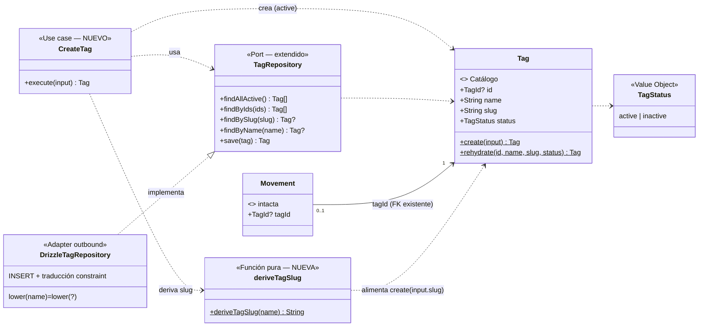

# Data Model: Creación de etiquetas desde el formulario de movimiento

**Feature**: `017-creacion-tags-formulario` | **Fecha**: 2026-10-04

Dos vistas del mismo modelo: **dominio** (VOs, entidades y funciones puras, principio VII) y **persistencia** (tablas Drizzle, principio V). Esta feature **no modifica ninguna entidad existente**: `Tag`, `Movement`, `Account` y `Member` quedan intactos. Añade la vía de creación que falta al catálogo de `Tag` — función de derivación de slug (dominio), caso de uso `CreateTag` y extensión del puerto `TagRepository` (aplicación) — y una Server Action de frontera. **Sin migración**: el esquema de `tags` soporta la creación desde 0000.

---

## 1. Vista de Dominio

### 1.1 Value Objects y funciones puras

Sin cambios: `Money` (ADR 0007), `MovementType`, `ExpenseNature`, `AccountType`, `TagStatus`, IDs (`MemberId`, `AccountId`, `TagId`, `MovementId`). Ver [002/data-model §1.1](../../002-registro-movimientos/data-model.md).

**NUEVO — `deriveTagSlug(name: string): string`** (`src/domain/tag/TagSlug.ts`, función pura sin dependencias):

| Paso | Regla | Ejemplo |
|---|---|---|
| 1 | `trim()` + `toLowerCase()` | `" Mascotas "` → `"mascotas"` |
| 2 | Normalizar NFD y eliminar diacríticos (`\p{Diacritic}`) | `"Alimentación"` → `"alimentacion"` |
| 3 | Cada carácter **no** alfanumérico (Unicode) → `-`; runs de `-` colapsan a uno; `-` de borde se recortan | `"Suscripciones online"` → `"suscripciones-online"`; `"Café y té"` → `"cafe-y-te"` |
| 4 | Puede devolver `""` (p. ej. nombre `"---"`); `Tag.create` lo rechaza con `InvalidTagError` existente | `"---"` → `""` → error |

Reproduce exactamente la convención manual del seed (verificada por test contra los 12 `SEED_TAGS`).

### 1.2 Entidades

#### `Tag` (Etiqueta) — SIN CAMBIOS de forma

| Campo | Tipo | Regla |
|---|---|---|
| id | `TagId \| null` | `null` en transitorias; asignado al persistir |
| name | `string` | Único ignorando mayúsculas (índice `lower(name)`); no vacío tras trim |
| slug | `string` | Único (case-sensitive); no vacío; **derivado automáticamente** desde 017 (el usuario nunca lo introduce) |
| status | `TagStatus` | `'active' \| 'inactive'`; **nace `'active'`** (FR-002) |

`Tag.create({ name, slug, status })` y `Tag.rehydrate(id, name, slug, status)` conservan sus contratos. La feature no añade renombrar/fusionar/desactivar (fuera de alcance).

#### `Movement`, `Account`, `Member` — intactos

La creación inline no toca el modelo del movimiento: la etiqueta creada llega al envío como un `tagId` real ya persistido (FK existente).

### 1.3 Caso de uso `CreateTag` (aplicación) — NUEVO

```ts
class CreateTag {
  constructor(tags: TagRepository)
  async execute(input: { name: string }): Promise<Tag>   // devuelve la Tag persistida (con id, active)
}
```

Orquestación (regla por paso, ver [research §1–§3](./research.md)):

1. `name = input.name.trim()`; si vacío → `InvalidTagError("El nombre de la etiqueta es obligatorio.")`.
2. `findByName(name)` (espejo de `lower(name)`, ignora estado) → si existe → `DuplicateTagNameError(name)` («Ya existe una etiqueta con el nombre "…".»), incluida una inactiva (edge).
3. `slug = deriveTagSlug(name)`; si `findBySlug(slug)` existe → probar `{slug}-2`, `{slug}-3`, … hasta hueco (colisión típica: «Alimentación» vs «Alimentacion» → `alimentacion-2`).
4. `save(Tag.create({ name, slug, status: "active" }))` → `Tag` con id.
5. Si el `save` revienta por el índice `lower(name)` (carrera) → traducir a `DuplicateTagNameError(name)`.

### 1.4 Puerto `TagRepository` — EXTENDIDO

```ts
export interface TagRepository {
  findAllActive(): Promise<Tag[]>;                        // existente
  findByIds(ids: readonly TagId[]): Promise<Tag[]>;       // existente
  findBySlug(slug: string): Promise<Tag | null>;          // existente (usada ahora también por CreateTag)
  findByName(name: string): Promise<Tag | null>;          // NUEVO: WHERE lower(name) = lower(?) — espejo del índice; ignora estado
  save(tag: Tag): Promise<Tag>;                           // NUEVO: INSERT → Tag con id asignado; constraint lower(name) → DuplicateTagNameError
}
```

El puerto sigue definido en aplicación (constitución VII); `save` recibe la entidad transitoria y devuelve la persistida (misma forma que `CreateMovement`/`MovementRepository`).

### 1.5 Diagrama de clases (diseño)



> Diferencias con `docs/architecture/diagrams/domain-model.md` (vivo, a actualizar en la implementación): aparece `deriveTagSlug`, el puerto `TagRepository` gana `findByName`/`save`, y el catálogo documenta su vía de creación (`CreateTag`). `Tag`, `Movement` y sus relaciones no cambian.

### 1.6 Transiciones de estado

- **Tag**: nace `active` (única transición que esta feature produce; `inactive` existe en el modelo pero solo por datos preexistentes — desactivar queda para la feature futura de mantenimiento).
- **UI de captación inline** (adaptador inbound): `[Select] → «+ Nueva etiqueta» → [captación abierta] → Crear → [creando] → éxito [Select con nueva tag seleccionada] | error [captación con mensaje, nombre conservado] | Cancelar → [Select como estaba]`. Detalle congelado en [contracts/ui-contract.md §2](./contracts/ui-contract.md).

---

## 2. Vista de Persistencia (Drizzle, SQLite/Turso)

### 2.1 Tablas

**SIN CAMBIOS. Sin migración** (research §2, principio V): la tabla `tags` existente ya materializa todas las invariantes de la feature.

```text
tags
├── id: integer PK autoincrement
├── name: text NOT NULL                    ← unicidad: UNIQUE INDEX tags_name_nocase_uq ON lower(name) (0000)
├── slug: text NOT NULL UNIQUE             ← derivado desde 017 (deriveTagSlug + sufijos -2/-3…)
└── status: text NOT NULL DEFAULT 'active' ← nace 'active' por defecto (FR-002)

movements, accounts, members               # INTACTAS (la tag llega al envío como tagId ya persistido)
```

### 2.2 Repositorio `DrizzleTagRepository` — EXTENDIDO

- `findByName(name)`: `select … where sql`lower(${tags.name}) = lower(${name})`` limit 1 → `Tag | null`. Mismo `lower` ASCII de SQLite que el índice (semántica idéntica: «Luz»≡«LUZ», «Alimentación»≢«Alimentacion»); ignora `status`.
- `save(tag)`: `insert(tags).values({ name, slug, status: "active" }).returning()` → `Tag.rehydrate(...)` con el id. Si el INSERT viola `tags_name_nocase_uq` (carrera entre check e insert) → `DuplicateTagNameError(tag.name)`.
- `findAllActive`/`findByIds`/`findBySlug` intactos.

### 2.3 Seed y catálogo

`seed-data.ts` y `scripts/seed.ts` **intactos** (FR-007): catálogo inicial del Excel y «Sin Clasificar» sin cambios; idempotencia por `slug` como hoy. Las tags creadas por la app conviven con las del seed sin distinción.

---

## 3. Validación por capa (dónde vive cada regla)

| Regla | Zod (frontera, action) | Dominio / Aplicación | DB (constraint) |
|---|---|---|---|
| Nombre presente, no vacío tras trim | ✅ `createTagSchema`: `z.string().trim().min(1)` «El nombre de la etiqueta es obligatorio.» | ✅ `CreateTag` revalida → `InvalidTagError` (mismo literal) | `name NOT NULL` |
| Nombre único ignorando mayúsculas (también inactivas) | — (no conoce el catálogo) | ✅ `CreateTag` vía `findByName` → `DuplicateTagNameError` «Ya existe una etiqueta con el nombre "…".» | ✅ UNIQUE `lower(name)` (red de seguridad ante carreras → traducido) |
| Slug derivado automáticamente, sin pedírselo al usuario | — | ✅ `deriveTagSlug` (dominio) + colisiones `-2/-3…` en `CreateTag` vía `findBySlug` | `slug UNIQUE` |
| Nace activa | — | ✅ `Tag.create({ status: "active" })` | `status DEFAULT 'active'` |
| La tag del movimiento existe y está activa (envío posterior) | ✅ `movementFormSchema` intacto | ✅ `resolveTagId` intacto (la nueva tag es una tag normal) | FK `movements.tag_id` |

**Mapeo de errores en la action** `createTag`: Zod → `{ ok: false, message }` (nombre vacío); `InvalidTagError` → ídem; `DuplicateTagNameError` → mensaje exacto del error de dominio; cualquier otro `DomainError` → mensaje genérico de formulario. Nunca se lanza al cliente: siempre `CreateTagResult`.

---

## 4. DTOs y contrato de la Server Action

```ts
// Reutilizado sin cambios
TagDTO { id: number; name: string; slug: string }            // src/application/movement/dto.ts

// NUEVO — src/infrastructure/primary/actions/create-tag.action.ts
createTagSchema: z.string().trim().min(1, "El nombre de la etiqueta es obligatorio.")

export type CreateTagResult =
  | { ok: true; tag: TagDTO }                                  // éxito: tag persistida, activa, con id
  | { ok: false; message: string };                            // nombre vacío | duplicado | error inesperado

export async function createTag(name: string): Promise<CreateTagResult>
// Éxito: revalidatePath("/", "layout") + devolver la tag; el movimiento NO se guarda (FR-004)
```

Las actions de movimiento (`createMovement`/`updateMovement`) y su schema **no cambian**: reciben un `tagId` numérico ya persistido, exactamente como hoy.

---

## 5. Glosario ES ↔ EN (constitución VI)

| Español (UI/spec) | English (código) | Notas |
|---|---|---|
| Etiqueta / Tag | `Tag` / `tagId` | Sin cambios |
| Crear etiqueta | `CreateTag` / `createTag` | Caso de uso (aplicación) / Server Action (adaptador) |
| Slug (identificador derivado) | `deriveTagSlug(name)` | Función pura de dominio; nunca visible para el usuario |
| Colisión de slug | `slug collision` → sufijo `-2`, `-3`… | Resuelta en `CreateTag` sin fricción |
| + Nueva etiqueta | `creatingTag` (estado UI) / `newTagName` | Entrada de la captación inline junto al Select |
| Etiquetas extra (tanda) | `extraTags` | Estado local del diálogo; sobrevive al remonte `key={savedCount}` |
| Tag creada en línea | inline tag creation | Patrón «+ Nueva etiqueta» |
| Mantenimiento de catálogo | (feature futura, fila 004) | Renombrar, fusionar, desactivar — fuera de alcance |

Sin identificadores intraducibles nuevos fuera de los listados.
