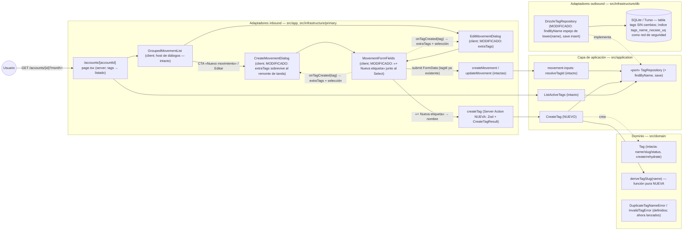
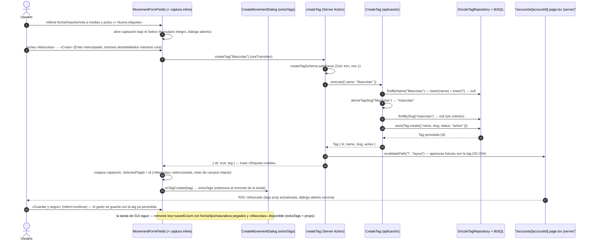

# Implementation Plan: Creación de etiquetas desde el formulario de movimiento

**Branch**: `feature/017-creacion-tags-formulario` | **Date**: 2026-10-04 | **Spec**: [spec.md](./spec.md)

**Input**: Feature specification from `/specs/017-creacion-tags-formulario/spec.md`

## Summary

La reducción de la fila `004-gestion-tags` a su necesidad real (decisión del propietario 2026-10-04): **crear etiquetas desde el propio formulario de movimiento**, junto al Select «Etiqueta», con el patrón «+ Nueva etiqueta». Hoy el catálogo solo se puebla por seed y, desde 014, la etiqueta es obligatoria en gastos: una etiqueta ausente obliga a salir del flujo. La feature añade la vía de creación que falta sin tocar el modelo de `Movement`, el catálogo del seed ni ninguna vista de desglose.

Enfoque técnico (detalles y alternativas en [research.md](./research.md)):

- **Server Action propia `createTag`** + caso de uso `CreateTag` (aplicación): la creación es inmediata e independiente del envío del movimiento (asunción de la spec; edge «etiqueta creada y movimiento cancelado»).
- **Derivación de slug en el dominio** (`deriveTagSlug`, función pura: minúsculas, sin acentos, separadores → guion) con **resolución automática de colisiones** en el caso de uso (`-2`, `-3`, … vía `findBySlug`), sin fricción para el usuario.
- **Duplicados ignorando mayúsculas** reutilizando la semántica del índice existente `lower(name)`: nuevo método de puerto `findByName` (espejo del índice) que por fin hace lanzar `DuplicateTagNameError` (definido desde 002, nunca usado).
- **Captación inline junto al Select**: bloque de nombre bajo el selector dentro de `MovementFormFields` (sin form anidado — llamada directa a la action + `useTransition`, Enter interceptado); al confirmar, la etiqueta queda **persistida, disponible y seleccionada**, con todos los demás datos intactos.
- **Disponibilidad inmediata sin depender del refresco**: estado `extraTags` en los diálogos (sobrevive al remonte `key={savedCount}` de la tanda de 014) + `revalidatePath("/", "layout")` para que aperturas futuras del formulario la vean (SC-004).
- **Sin migración** (el esquema `tags` ya soporta creación) y **cero dependencias nuevas**.

## Technical Context

**Language/Version**: TypeScript 5.x en modo estricto sobre Node.js LTS; Next.js 16 (App Router), React 19.

**Primary Dependencies**: las fijadas por la constitución v1.2.1 (next, react, drizzle-orm ~0.44.7, @libsql/client, zod 4, tailwind + shadcn/ui en el repo, sonner, radix-ui). **Cero dependencias nuevas.**

**Storage**: SQLite (dev) / Turso (prod) vía Drizzle. **Sin cambios de esquema y sin migración**: la tabla `tags` (`name`, `slug` unique, `status` default active) y el índice único `tags_name_nocase_uq ON lower(name)` ya existen desde 0000 y soportan la creación. El puerto `TagRepository` (hoy solo-lectura) gana `findByName` y `save`.

**Testing**: Vitest (projects node/ui, co-localizados) — dominio (`deriveTagSlug`), aplicación (`CreateTag`: vacío, duplicado case-insensitive, duplicado de inactiva, colisión de slug, alta activa), repositorio (`findByName`, `save` contra libsql `:memory:`), action (`createTag` con Zod y revalidación) y componentes (captura inline en alta/edición: éxito, error, cancelación, conservación de datos, tanda). Playwright e2e: **spec nueva** `creacion-tags.spec.ts` (Miembro B + **mayo 2026**, combinación libre de colisiones — research §6) que cubre el flujo crítico «registrar gasto creando su etiqueta en línea dentro de una tanda» (FR-009, constitución III).

**Target Platform**: Web (escritorio primero; usable en móvil), Vercel + Turso; sin cambios.

**Project Type**: web-app (monolito Next.js, App Router); sin proyectos ni paquetes nuevos.

**Performance Goals**: SC-001 — registrar un gasto cuya etiqueta no existe con **una sola apertura del diálogo**; la creación inline añade solo teclear el nombre y confirmar. Sin metas de rendimiento nuevas (1 usuario, 3 cuentas).

**Constraints**: UI en español (literales congelados en el ui-contract); sin cerrar ni navegar fuera del diálogo (FR-001); la tanda continua de 014 intacta (FR-005); catálogo del seed y «Sin Clasificar» intactos (FR-007); desgloses y páginas `/`, `/summary`, `/annual` sin cambios.

**Scale/Scope**: 1 usuario, 3 cuentas; 1 función de dominio nueva (+test), 1 caso de uso + 2 métodos de puerto (+tests), 1 método de repositorio por puerto nuevo (+tests), 1 action nueva (+test), 3 componentes UI tocados (form + 2 diálogos, +tests), 1 spec e2e nueva; documentación viva (ADR 0015, diagramas) y roadmap maestro (FR-008).

## Constitution Check

*GATE: Must pass before Phase 0 research. Re-check after Phase 1 design.*

| # | Principio | Estado pre-diseño | Notas |
|---|-----------|-------------------|-------|
| I | Simplicidad Primero | ✅ PASS | Reutiliza todo lo existente: `Tag` sin cambios estructurales, índice `lower(name)` ya creado, `DuplicateTagNameError` ya definido, Select/Input/Button shadcn ya en el repo, patrón de estado en diálogos de 014. Sin proyectos, librerías, tablas ni migraciones nuevas. La captación inline evita un diálogo anidado y un form anidado (HTML lo prohíbe). |
| II | Spec-Driven Development | ✅ PASS | Este plan deriva de `specs/017-creacion-tags-formulario/spec.md` (reducción de la fila 004 decidida por el propietario 2026-10-04). Una única US pequeña con valor propio; no aplica excepción de granularidad. Las enmiendas al maestro quedan como FR-008. |
| III | Calidad Verificada | ✅ PASS | Lógica de negocio nueva (derivación de slug, duplicados case-insensitive, colisiones) cubierta por tests de dominio/aplicación/repositorio; flujo crítico «registrar gasto creando su etiqueta en línea dentro de una tanda» cubierto por e2e nueva (FR-009, exigencia explícita de constitución III). |
| IV | TypeScript Estricto + Zod | ✅ PASS | Frontera nueva `createTagSchema` (Zod, trim + min 1) en la action; resultado tipado como unión discriminada `CreateTagResult`; DTOs existentes (`TagDTO`) reutilizados; sin `any`. |
| V | Persistencia SQLite con Drizzle | ✅ PASS | Sin cambios de esquema ni migración (la tabla `tags` ya soporta creación); el índice único `lower(name)` existente queda como red de seguridad frente a carreras de inserción; sin SQL ad-hoc fuera de Drizzle. |
| VI | Producto en español, código en inglés | ✅ PASS | Literales nuevos en español congelados en el ui-contract («+ Nueva etiqueta», «Crear», «Cancelar», «Etiqueta creada», «El nombre de la etiqueta es obligatorio.», «Ya existe una etiqueta con el nombre "…".»); identificadores en inglés (`createTag`, `deriveTagSlug`, `findByName`, `extraTags`); glosario actualizado (data-model §5). |
| VII | Arquitectura Hexagonal + DDD Táctico | ✅ PASS | `deriveTagSlug` es función pura del dominio (sin deps); `CreateTag` y los métodos de puerto (`findByName`, `save`) viven en aplicación; `DrizzleTagRepository` y la action son adaptadores; la UI solo captura un nombre y pinta el estado. Sin CQRS/EDA/eventos; `DuplicateTagNameError` pasa de definido a usado sin cambiar el dominio. |

**Resultado**: sin violaciones → Phase 0 autorizada.

## Project Structure

### Documentation (this feature)

```text
specs/017-creacion-tags-formulario/
├── plan.md                     # This file (/speckit.plan command output)
├── research.md                 # Phase 0 output (/speckit.plan command)
├── data-model.md               # Phase 1 output (/speckit.plan command)
├── quickstart.md               # Phase 1 output (/speckit.plan command)
├── contracts/
│   └── ui-contract.md          # Contrato UI + Server Action createTag (captación inline)
└── tasks.md                    # Phase 2 output (/speckit.tasks command - NOT created by /speckit.plan)
```

### Source Code (repository root)

```text
├── src/
│   ├── domain/
│   │   └── tag/
│   │       ├── TagSlug.ts             # NUEVO: deriveTagSlug(name) — función pura (minúsculas, sin acentos, no alfanum → guion, recorte)
│   │       └── TagSlug.test.ts        # NUEVO: casos del seed (Alimentación→alimentacion, Suscripciones online→suscripciones-online), vacíos/extremos
│   │   ├── Tag.ts, TagErrors.ts, TagId.ts, TagStatus.ts   # INTACTOS (DuplicateTagNameError pasa a lanzarse; sin cambios de forma)
│   │   └── movement/                  # INTACTO (la creación inline no toca el modelo del movimiento)
│   ├── application/
│   │   └── tag/
│   │       ├── TagRepository.ts       # MODIFICADO: + findByName(name) (espejo del índice lower(name)) y save(tag) → Tag persistida
│   │       ├── CreateTag.ts           # NUEVO: use case — trim, duplicado case-insensitive, slug derivado + colisiones, alta activa
│   │       ├── CreateTag.test.ts      # NUEVO: vacío, duplicado (LUZ vs Luz), duplicado de inactiva, colisión -2/-3, activa por defecto
│   │       └── ListActiveTags.ts (+test)  # INTACTO
│   ├── app/
│   │   └── accounts/[accountId]/page.tsx   # INTACTO (ya carga tags y las baja a los diálogos)
│   └── infrastructure/
│       ├── db/
│       │   ├── DrizzleTagRepository.ts     # MODIFICADO: + findByName (sql lower(name)=lower(?)) y save (insert → Tag con id)
│       │   └── DrizzleRepositories.test.ts # AMPLIADO: findByName case-insensitive (y semántica de acentos), save persiste y devuelve id
│       └── primary/
│           ├── actions/
│           │   ├── create-tag.action.ts        # NUEVO: createTag(name) → CreateTagResult; Zod; revalidatePath("/", "layout")
│           │   ├── create-tag.action.test.ts   # NUEVO: nombre vacío, duplicado, éxito (tag devuelta; revalidación mockeada)
│           │   └── create-movement.action.ts, update-movement.action.ts, movement-form.schema.ts  # INTACTOS
│           └── ui/
│               ├── movement-form.tsx        # MODIFICADO: bloque «+ Nueva etiqueta» junto al Select (captura inline, Enter interceptado, botones deshabilitados, error con valor conservado) + prop onTagCreated; precedencia de selección tras creación
│               ├── movement-form.test.tsx   # AMPLIADO: apertura/creación/cancelación/error, selección de la nueva tag, datos intactos
│               ├── create-movement-dialog.tsx      # MODIFICADO: estado extraTags (sobrevive al remonte key=savedCount) + merge ordenado
│               ├── create-movement-dialog.test.tsx # AMPLIADO: tag creada disponible en capturas siguientes de la tanda
│               ├── edit-movement-dialog.tsx        # MODIFICADO: mismo patrón extraTags/onTagCreated
│               ├── edit-movement-dialog.test.tsx   # AMPLIADO: creación inline en edición y guardado con la nueva tag
│               └── grouped-movement-list.tsx (+test), delete-movement-dialog.tsx  # INTACTOS (solo reciben tags como hoy)
├── e2e/
│   └── creacion-tags.spec.ts       # NUEVO: flujo crítico — alta con etiqueta creada en línea en mitad de tanda; duplicado; cancelación; edición (Miembro B, mayo 2026)
│   (resto de specs)                # INTACTAS (la combinación cuenta/mes elegida no colisiona — research §6)
├── scripts/seed.ts, src/infrastructure/db/seed-data.ts, drizzle/   # INTACTOS (sin migración; catálogo y «Sin Clasificar» intactos — FR-007)
├── specs/001-family-wallet/spec.md  # ACTUALIZADO (implementación, FR-008): fila 017 «Completada» + reducción de 004 a mantenimiento de catálogo
└── docs/architecture/
    ├── overview.md, diagrams/domain-model.md, diagrams/registro-movimiento-sequence.md  # ACTUALIZADOS (implementación): vía de creación de tags
    └── adr/0015-creacion-tags-inline-action-propia.md  # NUEVO: action propia vs envío del movimiento; derivación de slug y colisiones; extraTags + revalidación
```

**Structure Decision**: misma estructura por capas concéntricas que 002–016 (`docs/architecture/overview.md`). El cambio atraviesa las capas en la dirección de dependencias: la derivación del slug vive en el dominio (pura), la regla de duplicados y la resolución de colisiones en el caso de uso (aplicación) contra el puerto ampliado, y la action/UI son adaptadores finos. Sin cambios en persistencia (el esquema ya soporta la creación). Tests co-localizados; e2e nueva en fichero propio con combinación cuenta/mes exclusiva (`workers: 1`).

## Diagramas de diseño

Foto del diseño de esta feature (mermaid, como la documentación viva del proyecto); `docs/architecture/diagrams/` se extiende en la fase de implementación reutilizándolos como base. El diagrama de clases del modelo vive en [data-model.md §1.5](./data-model.md).

### Componentes que intervienen



> Nota: dependencias siempre hacia el dominio (constitución VII). La UI no decide negocio: captura un nombre y pinta el resultado; las reglas (vacío, duplicado, slug, estado activo) viven en `CreateTag`/dominio; la unicidad case-insensitive queda respaldada por el índice de BD. `extraTags` y la selección son estado local de los adaptadores inbound (igual que `savedCount`/`carry` en 014).

### Secuencia — happy path: crear etiqueta en línea y guardar el gasto (tanda de 014 intacta)



## Complexity Tracking

> **Fill ONLY if Constitution Check has violations that must be justified**

| Violation | Why Needed | Simpler Alternative Rejected Because |
|-----------|------------|-------------------------------------|
| (ninguna) | — | — |

**Decisiones de diseño destacadas (sin violación, registradas para `/speckit.tasks`)**:

- **Server Action propia `createTag`, no creación en el envío del movimiento** (resuelve la nota de la spec): FR-004 exige persistencia + selección inmediatas antes del envío, el edge «etiqueta creada y movimiento cancelado» exige que persista aunque el movimiento se cancele, y FR-005 exige disponibilidad en las capturas siguientes de la tanda sin pasar por el guardado (research §1).
- **Llamada directa a la action + `useTransition`** en la captura inline (sin `useActionState` ni `<form>` propio): los formularios anidados están prohibidos en HTML y un diálogo anidado añade fricción; el nombre ya vive en estado local, no hay que repoblarlo desde un estado de action (research §4).
- **`findByName` como espejo exacto del índice `lower(name)`** (SQL `lower()`, ASCII): replica la semántica vigente de unicidad — «Luz»/«LUZ» duplicado, «Alimentación»/«Alimentacion» no — e ignora el estado (una inactiva también bloquea, edge de la spec). La carrera de inserción queda cubierta por el propio índice, mapeado a `DuplicateTagNameError` (research §2).
- **Slug derivado en el dominio (`deriveTagSlug`) + resolución de colisiones en el caso de uso** (`-2`, `-3`, … con `findBySlug`): el usuario solo introduce el nombre; la colisión por acentos («Alimentación» vs «Alimentacion») se resuelve sin fricción ni decisiones del usuario (edge de la spec) (research §3).
- **`extraTags` en los diálogos + `revalidatePath("/", "layout")`**: disponibilidad inmediata sin depender del timing del refresco (FR-004/FR-005) y consistencia en aperturas futuras del formulario con la misma página montada (SC-004) — la action no conoce la página origen y el coste de invalidar el árbol es irrelevante con 1 usuario (research §5).
- **Spec e2e nueva `creacion-tags.spec.ts` con Miembro B + mayo 2026**: el flujo crítico de la feature (registrar gasto creando su etiqueta en línea en tanda) merece fichero propio; la combinación cuenta/mes queda analizada frente a todas las specs existentes y su orden alfabético efectivo (research §6).

## Constitution Check (post-diseño, Phase 1)

Re-evaluación tras generar [research.md](./research.md), [data-model.md](./data-model.md), [contracts/ui-contract.md](./contracts/ui-contract.md) y [quickstart.md](./quickstart.md):

| # | Principio | Estado post-diseño | Notas |
|---|-----------|--------------------|-------|
| I | Simplicidad Primero | ✅ PASS | El diseño añade una función pura, un caso de uso, dos métodos de puerto/repositorio, una action y un bloque UI; reutiliza índice, error de dominio, Select shadcn y el patrón de estado de los diálogos de 014. Nada de migraciones, librerías, diálogos anidados ni formularios anidados (research §1–§5). |
| II | Spec-Driven Development | ✅ PASS | Cada FR traza a artefacto: FR-001 → ui-contract §1/§2 + research §4; FR-002 → data-model §1.2/§1.3 + ui-contract §5; FR-003 → data-model §1.4/§3 + research §2; FR-004 → research §1/§5 + ui-contract §2/§3; FR-005 → research §5 + ui-contract §3; FR-006 → ui-contract §4; FR-007 → Project Structure (seed/drizzle intactos); FR-008 → research §7 + Project Structure; FR-009 → research §6 + quickstart gates. Los 6 escenarios de aceptación y los 7 edge cases quedan cubiertos en ui-contract/quickstart. |
| III | Calidad Verificada | ✅ PASS | Quickstart con 6 escenarios (espejo de los de aceptación) + gates; suites nuevas por capa donde la feature arriesga (duplicado case-insensitive, colisión de slug, conservación de datos, tanda); flujo crítico e2e nuevo con aislamiento verificado (SC-005, constitución III). |
| IV | TypeScript Estricto + Zod | ✅ PASS | `createTagSchema` valida la frontera nueva (trim + min 1, mensaje congelado); `CreateTagResult` unión discriminada tipada; puertos y DTOs tipados; sin `any` (data-model §3/§4, ui-contract §5). |
| V | SQLite con Drizzle | ✅ PASS | Sin esquema nuevo ni migración: la tabla `tags` y su índice `lower(name)` (0000) ya materializan las invariantes; `save` usa Drizzle insert; el constraint queda como red de seguridad ante carreras (data-model §2, research §2). |
| VI | Español / inglés | ✅ PASS | Literales congelados en el ui-contract («+ Nueva etiqueta», «Crear», «Cancelar», «Creando…», «Etiqueta creada», «El nombre de la etiqueta es obligatorio.», «Ya existe una etiqueta con el nombre "…".»); identificadores en inglés (`createTag`, `deriveTagSlug`, `findByName`, `save`, `extraTags`); glosario ES↔EN ampliado (data-model §5). |
| VII | Hexagonal + DDD táctico | ✅ PASS | `deriveTagSlug` pura en dominio; `CreateTag` orquesta reglas contra el puerto (aplicación); `DrizzleTagRepository` y la action son adaptadores; la UI no duplica negocio (captura un nombre, pinta resultado, mantiene estado local de adaptador); sin puertos redundantes, eventos, CQRS ni EDA (data-model §1, diagramas). |

**Resultado**: diseño aprobado; sin desviaciones que justificar. El plan queda listo para `/speckit.tasks`.
